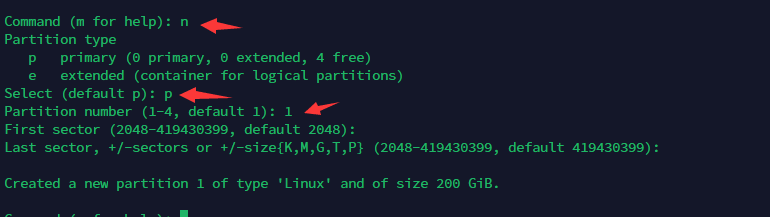

封面来源：[#オリジナル 寒空 - みふる的插画 - pixiv](https://www.pixiv.net/artworks/65735974)
### 前言
### 开始
使用 `fdisk` 查看服务器磁盘

```
root@Server:~# fdisk -l
Disk /dev/sdb: 200 GiB, 214748364800 bytes, 419430400 sectors
Disk model: QEMU HARDDISK   
Units: sectors of 1 * 512 = 512 bytes
Sector size (logical/physical): 512 bytes / 512 bytes
I/O size (minimum/optimal): 512 bytes / 512 bytes


Disk /dev/sda: 30 GiB, 32212254720 bytes, 62914560 sectors
Disk model: QEMU HARDDISK   
Units: sectors of 1 * 512 = 512 bytes
Sector size (logical/physical): 512 bytes / 512 bytes
I/O size (minimum/optimal): 512 bytes / 512 bytes
Disklabel type: dos
Disk identifier: 0xe1b7944a

Device     Boot    Start      End  Sectors  Size Id Type
/dev/sda1  *        2048 60913663 60911616   29G 83 Linux
/dev/sda2       60915710 62912511  1996802  975M  5 Extended
/dev/sda5       60915712 62912511  1996800  975M 82 Linux swap / Solaris


Disk /dev/sdc: 100 GiB, 107374182400 bytes, 209715200 sectors
Disk model: QEMU HARDDISK   
Units: sectors of 1 * 512 = 512 bytes
Sector size (logical/physical): 512 bytes / 512 bytes
I/O size (minimum/optimal): 512 bytes / 512 bytes
```
其中我的服务器系统安装在 **/dev/sda** 磁盘中，那么我有两个磁盘需要挂载，分别为 **/dev/sdc**和 **/dev/sdb**

首先新建一个文件夹为挂载的文件夹
```
mkdir sdc
mkdir sdb
```
然后在硬盘新建分区
```
fdisk /dev/sdc
```

依次输入**n，p，1**

然后再输入**w**保存

其他硬盘也是如此

然后输入`lsblk -f`查看，我们已经分好两个分区了，但是还没有UUID和文件系统，所以接下来要为硬盘加文件系统
```
root@Server:~# lsblk -f
NAME   FSTYPE  FSVER            LABEL                 UUID                                 FSAVAIL FSUSE% MOUNTPOINT
sda                                                                                                       
├─sda1 ext4    1.0                                    1376cd2f-30e7-47b5-8b33-6d0f8bf1e55c   24.4G     9% /
├─sda2                                                                                                    
└─sda5 swap    1                                      ce39fcd1-ebbe-46f7-b1b3-0d22ab347b12                [SWAP]
sdb                                                                                                       
└─sdb1                                                                                                    
sdc                                                                                                       
└─sdc1                                                       
```
输入`mkfs.ext4 /dev/sdb`来为 **/dev/sdb** 格式化新增文件系统

然后输入`lsblk -f`就能看到你的硬盘UUID了
```
root@Server:~# lsblk -f
NAME   FSTYPE  FSVER            LABEL                 UUID                                 FSAVAIL FSUSE% MOUNTPOINT
sda                                                                                                       
├─sda1 ext4    1.0                                    1376cd2f-30e7-47b5-8b33-6d0f8bf1e55c   24.4G     9% /
├─sda2                                                                                                    
└─sda5 swap    1                                      ce39fcd1-ebbe-46f7-b1b3-0d22ab347b12                [SWAP]
sdb    ext4    1.0                                    5e60cd17-d66b-42dd-b8c9-cfc3880b6c47                
sdc    ext4    1.0                                    7ece8097-7a6a-4778-a5f9-c56b951670d7  
```
然后编辑 **/etc/fstab** ，为磁盘新增开机挂载

在最后一行新增：

`UUID=7ece8097-7a6a-4778-a5f9-c56b951670d7 /sdc ext4 defaults 0 2`

然后保存重启就自动挂载了

- 这里的UUID是硬盘的UUID

- ext4是硬盘的文件系统

- defaults是挂载方式

### 参考资料
[浅析 fstab 与移动硬盘挂载方法](https://shumeipai.nxez.com/2019/01/17/fstab-and-mobile-hard-disk-mounting-method.html#:~:text=defaults%20%E2%80%93%20%E4%BD%BF%E7%94%A8%E6%96%87%E4%BB%B6%E7%B3%BB%E7%BB%9F%E7%9A%84%E9%BB%98%E8%AE%A4%E6%8C%82%E8%BD%BD%E5%8F%82%E6%95%B0%EF%BC%8C%E4%BE%8B%E5%A6%82%20ext4%20%E7%9A%84%E9%BB%98%E8%AE%A4%E5%8F%82%E6%95%B0%E4%B8%BA%3A%20rw%2C%20suid%2C,dev%2C%20exec%2C%20auto%2C%20nouser%2C%20async.%203%20Desktop%20Environment%E7%9A%84%E8%87%AA%E5%8A%A8%E6%8C%82%E8%BD%BD)

[Debian 开机自动挂载磁盘](https://www.cnblogs.com/xs-xs/p/16391152.html)

#### options常用参数类型：
- auto – 在启动时或键入了 mount -a 命令时自动挂载。
- noauto – 只在你的命令下被挂载。
- exec – 允许执行此分区的二进制文件。
- noexec – 不允许执行此文件系统上的二进制文件。
- ro – 以只读模式挂载文件系统。
- rw – 以读写模式挂载文件系统。
- user – 允许任意用户挂载此文件系统，若无显示定义，隐含启用 noexec, nosuid, nodev 参数。
- users – 允许所有 users 组中的用户挂载文件系统.
- nouser – 只能被 root 挂载。
- owner – 允许设备所有者挂载.
- sync – I/O 同步进行。
- async – I/O 异步进行。
- dev – 解析文件系统上的块特殊设备。
- nodev – 不解析文件系统上的块特殊设备。
- suid – 允许 suid 操作和设定 sgid 位。这一参数通常用于一些特殊任务，使一般用户运行程序时临时提升权限。
- nosuid – 禁止 suid 操作和设定 sgid 位。
- noatime – 不更新文件系统上 inode 访问记录，可以提升性能(参见 atime 参数)。
- nodiratime – 不更新文件系统上的目录 inode 访问记录，可以提升性能(参见 atime 参数)。
- relatime – 实时更新 inode access 记录。只有在记录中的访问时间早于当前访问才会被更新。（与 noatime 相似，但不会打断如 mutt 或其它程序探测文件在上次访问后是否被修改的进程。），可以提升性能(参见 atime 参数)。
- flush – vfat 的选项，更频繁的刷新数据，复制对话框或进度条在全部数据都写入后才消失。
- defaults – 使用文件系统的默认挂载参数，例如 ext4 的默认参数为:rw, suid, dev, exec, auto, nouser, async.
- 第一个0是开机不检查磁盘，若为1则为检查（检查开机会变慢）
- 第二个2为普通分区（0表示交换分区，1代表启动分区（Linux），2表示普通分区）