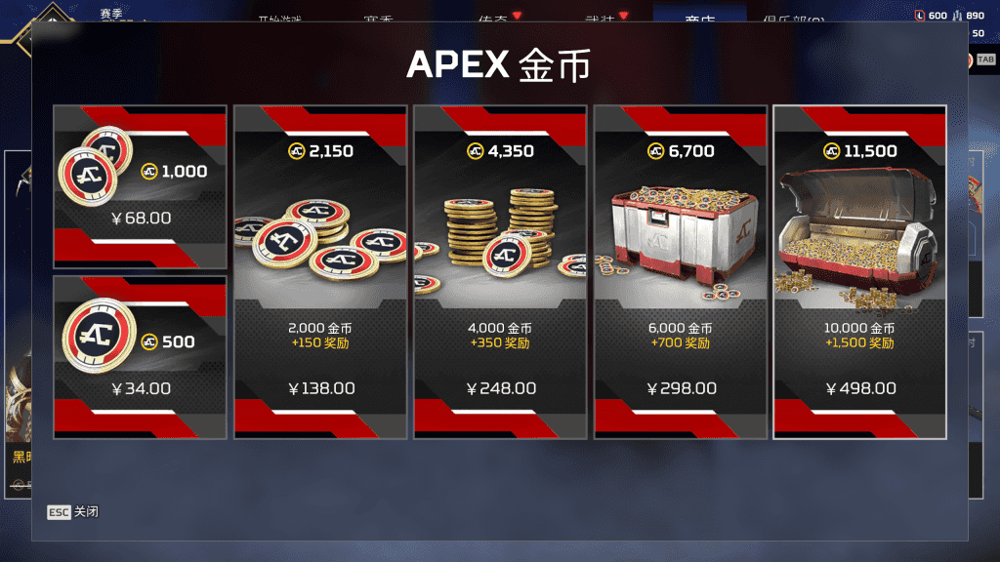

### 前言
由于我是地平线玩家，最近有爆料称地平线传家宝将在21号上架，所以我就琢磨了一下怎么充值最划算！
### 开始
传家宝都是通过收集活动获取的，你只需要在商城内购买24个活动箱子，那么就会获得传家宝。

那么24个活动箱子需要多少金币呢？

答案是16800金币，如果你直接买，则需要 498+298=796元（余1400金币）

但，若你先购买商城内**两个捆绑包**（一共7500金币）这时候就会获得10个箱子和2个皮肤，届时，你只需要购买**12个箱子**（8400金币）即可

所以总花费 **15900** 金币

你需要购买 498+248=746 ，但我们这时候还缺50金币，你要么购买34挡位的，或者再买个通行证余下50金币，亦或者做活动领一个传家宝箱子~还或者花800金属买个皮肤都行。

这就是最低价格了吗？当然不是！

开通EA PLAY即可9折充值！

现在EA PLAY售价38，开通后充值只需9折，那么我们总共花费 746×0.9+38=709.4！

若你会倒余额，那么只需570.69+32.3=602.99（85折）

按照以上思路，如果你有800制造金属，就可以少花700金币。
