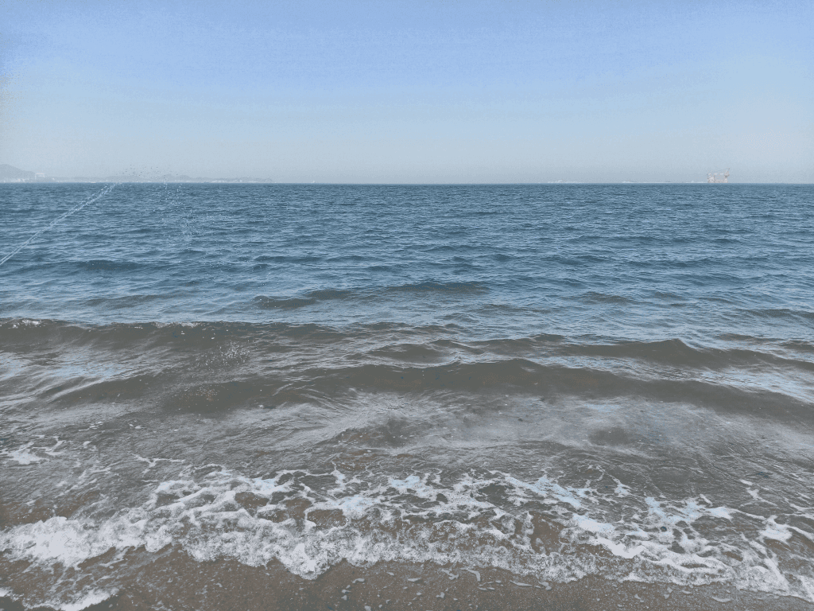
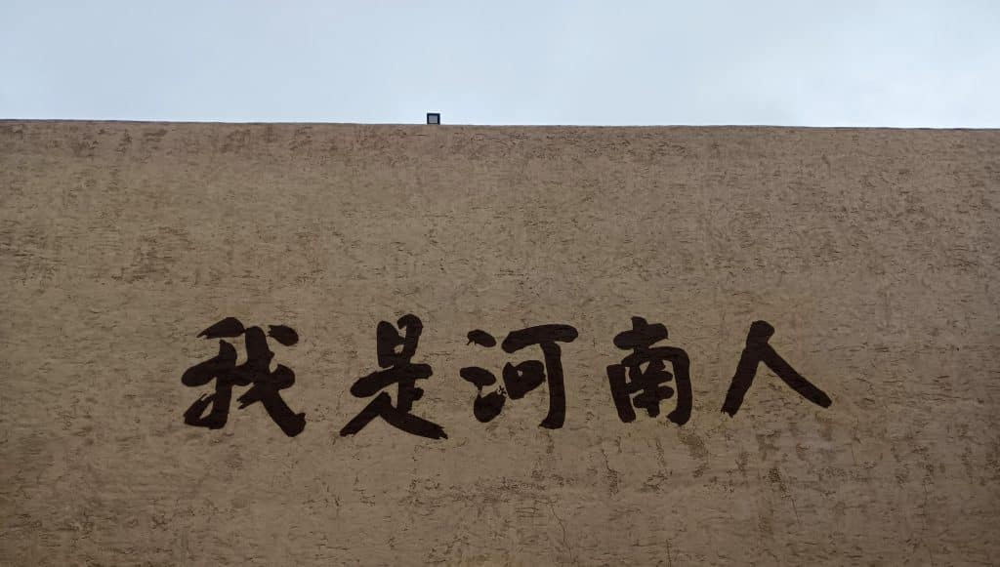
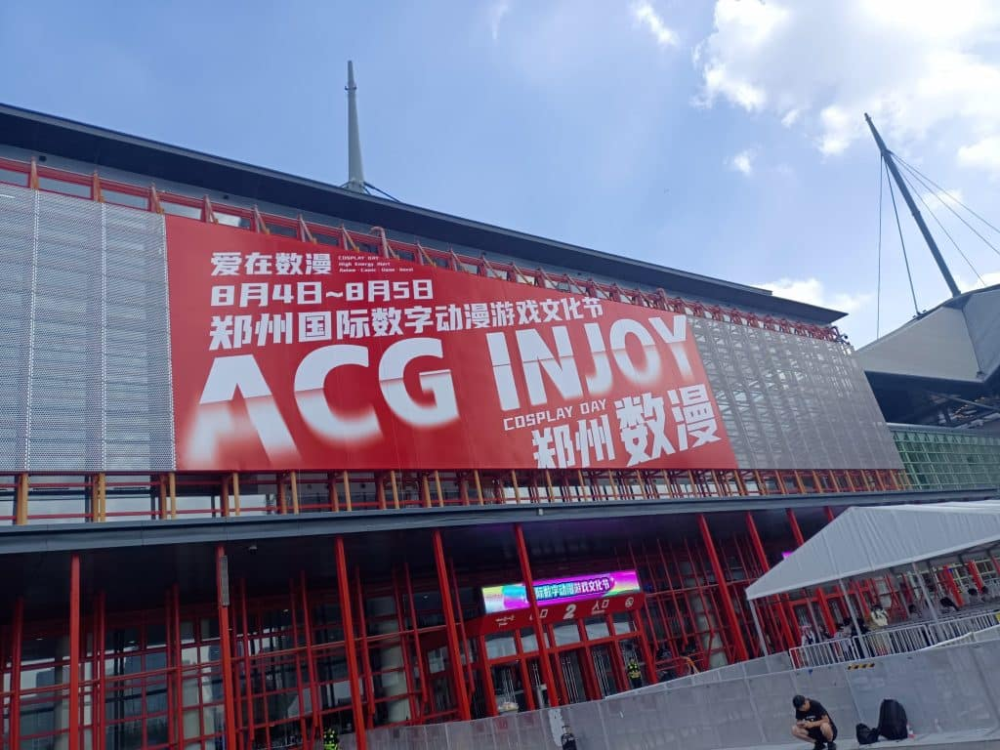

封面来源：[#オリジナル 空を奏でて - みふる的插画 - pixiv](https://www.pixiv.net/artworks/77559996)

雪已迎，临近月末；新年也将要到来，虽说距离春节仍有一段时间，但是看着2023马上就要变为2024，这令我想回望今年并有所总结，我将会尽量的回忆。

首先，在今年变化最大的就是在八月份，我重拾了自己的学业，我可能和部分人提过，那在此我就再重拾一下这片回忆吧。

在一年多以前，大概在我八年级下学期的时候，我因为一些个人原因和外来因素选择了休学，基本上不怎么去学校了，在家的这段时间内有很多难忘的人和事，在这段时间内，我主要的工作就是运营服务器，我总要给自己找一些事情做的，很幸运的是在今年服务器宣发工作和开发工作做的很好，迎来了部分人的游玩，相比去年，这算是一种进步，而且服务器有了[公会](https://yzhguild.mysxl.cn/)的支持，在资金方面压力变得很小了，我也很幸运能遇到这些志同道合的朋友。 如果感兴趣的话可以看一下服务器的年度总结，大概在这篇文章发布后的几天内就写出来了。在家的这段时间内就一直的在“不务正业”我这个年纪本该是在校园内学习，却在家中不知道做些什么。我虽有些后悔，但我还是很欣赏当时的自己。但自己在家难免会很孤独，少了很多现实中同学的交流，所以我在网上高强度冲浪，如果你这两年和我有好友，那么你能看到我几乎每天都在线。这一年多我遇到了一些人，我们几乎每天都在一起玩游戏，我似乎开始依赖他们这种陪伴，如果哪天晚上我们没有一起玩的话，我会感到很失落。如果他们有时候忽视我的话我也感觉很伤心。为什么总是在晚上呢？因为我在家的这段时间内都是保持晚上十点左右醒来，早上九点左右睡觉。我似乎太过于封闭自己了，我也意识到了这个问题，于是我开始找一些事情做，在今年的一月十四日，我发布了B站中第一款属于我自己的爆款视频，播放量现在有18万左右[B站主页传送门已部署](https://space.bilibili.com/511629145)！，这年，我也开始着手在抖音发布我的游戏视频，直至目前为止，我共发布了两条B站视频，但第二条播放似乎不怎么令人满意，我开始审视自己，我开始对自己的选题有了把控，这就导致了我并没有什么视频选材，所以至目前为止今年仅有两条视频，而抖音方面，我似乎在某天晚上因为某些原因把视频全删了，所以目前并没有视频了。

我常常在家打一些竞技游戏，在年初，我开了一台[战地五服务器](https://www.bilibili.com/opus/745916741548245000)，然后打了两个月的战地5，然后因为战地5热度的下降，我不得不放弃这款游戏（不过最近怎么又火起来了），但我也遇到了很多志同道合的朋友，也收到了礼物（小黑盒娘手办）这段时光真的很快乐。然后就是彩虹六号，每天沉迷于彩6，令我印象深刻的就是经常玩的一个姐姐，她和我的作息差不多，我们的处境也差不多，我们一起玩了很多天，现在回想起来她似乎是今年第一个和我一起玩游戏的女生，我并不像大多数人一样喜欢和异性一起玩游戏，如果匹配到了女生我也不会主动去交流，有种非常害羞的感觉；她在几个月前把我删了，我不知道任何原因，可能是我们很久没有联系了，我现在找不到关于她的踪迹了，我也不想去找。然后就开始玩APEX了，我身边一起玩的朋友很少，我也很少去找人一起玩，大部分时间都是在单排。有时候遇到瓶颈期打不过的时候我会质疑自己，开始怀疑自己，然后陷入无尽的精神内耗当中，自闭起来无休止的练习。我在现实中的朋友也非常得少，我似乎并不算是他们最好的朋友。今年五月，我们一同前往烟台看海。 \
 

然后我们也一同前往了郑州的《遇见河南》与当地的漫展

   

很开心，这是我第一次出省。

然后就是我的学校了，中考只考了389分，除去体育与实验（实验还是我看完了视频然后去考的）裸分263分，但好在过了高中分数线，算是被第三志愿录取吧，我依稀记得我的中考是纯裸考，那天化学考试我甚至什么也不会（因为化学九年级才学，而我九年级根本没去学校）进入第三志愿的私立学校一点也不奇怪。因为是私立，所以在收费与管理上面都特别高，我们十人住一个宿舍，每天洗漱都要排很久的队，饭也不好吃，但我在那里的成绩还算不错，能算是个全校前五吧，前几名基本都是别的重点高中休学来到这里的，我现在还记得我们数学老师曾经说过有家长反应她们讲的题太难了，但实际上这些题在我看来只是基础往上的一些东西。我还记得有次午练后数学老师在课堂上哭了，我能够理解她，也能够同情她。

无论如何今年马上就要过去了，现在是周五，我从学校请假回到了家中。我非常难受也非常伤心，这次的联考我似乎做的一塌糊涂。我对不起这些老师。我决定回家调整一下状态，我感到这几天在学校没有学习的心情了。

总结来说今年似乎过得很快，快到我的记忆少之又少，好像仅仅把一天过了半年，又把另一天过了半年一样。就此结束吧！

有人可能会注意到我更换了博客背景，我开始决定每年换一个背景！

完

00点48分

2023/12/22