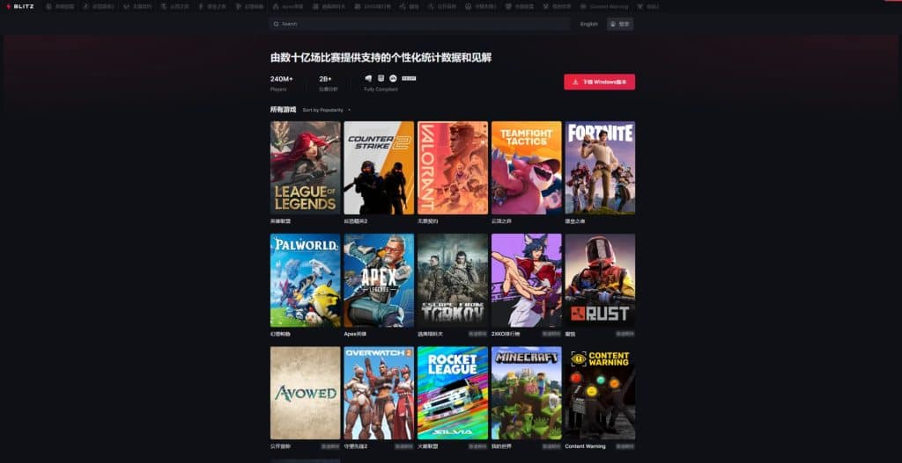
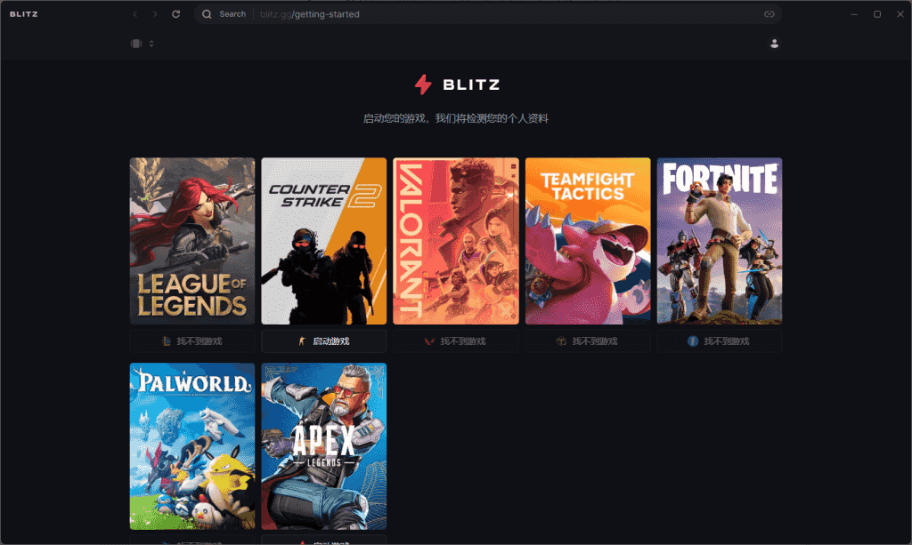
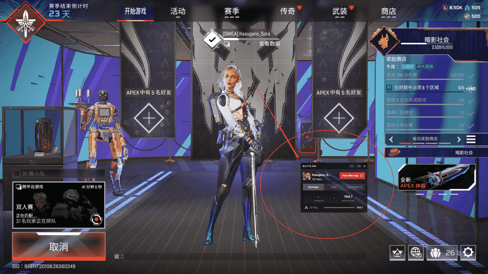
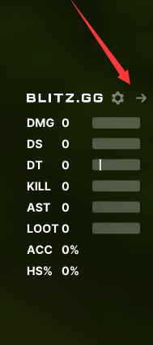
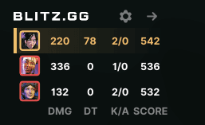
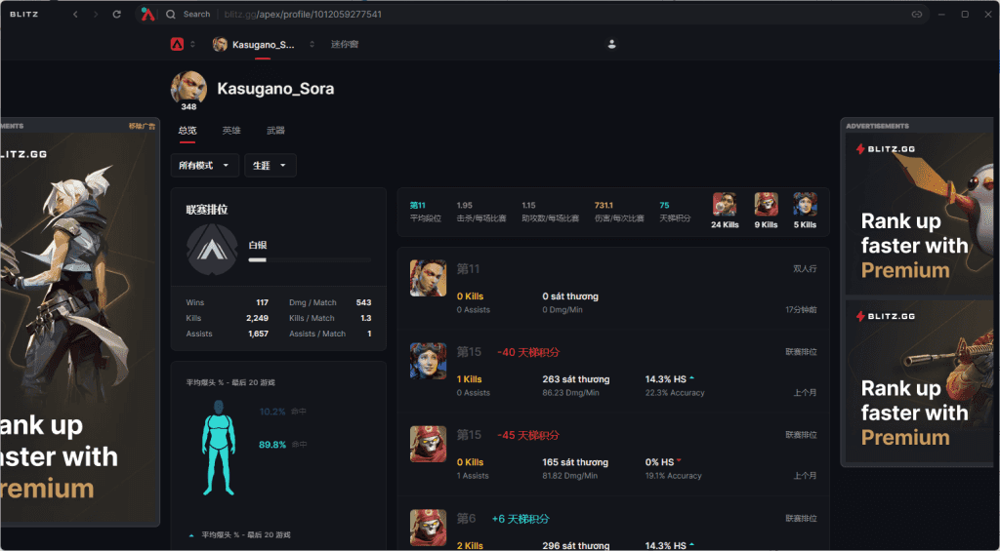
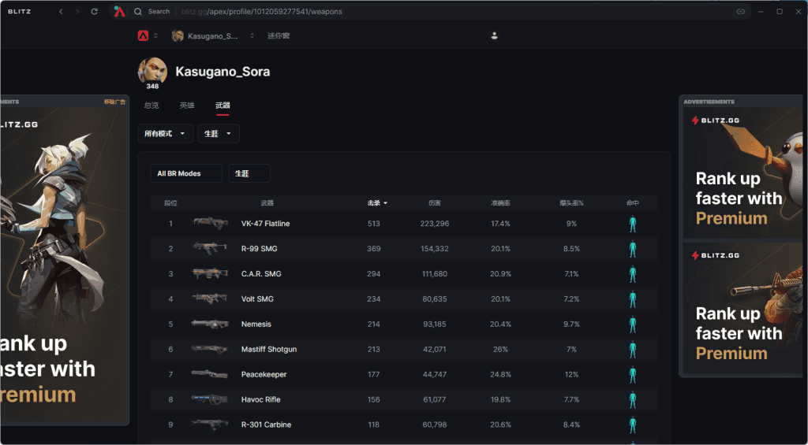
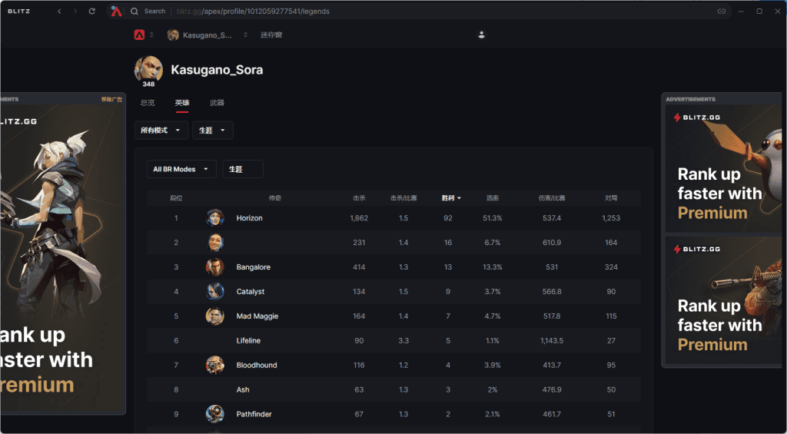
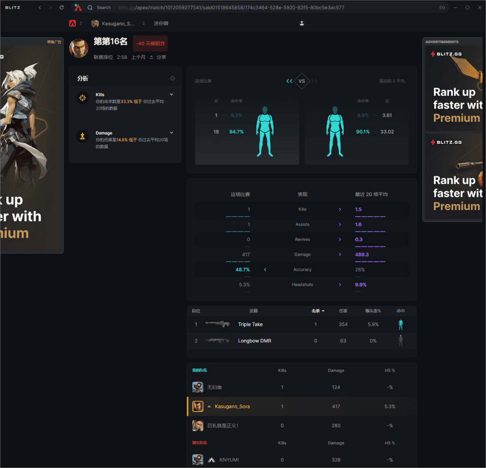

### 前言

在很多时候，无论是单排还是开黑，总是想在游戏还未结算时就看到队友伤害，无论是单排打完一波架后查看队友成分，好让自己心中有个数；还是在组排中打完一波架后实时开庭惩罚没干活的队友。而本章就推荐大家使用软件blitz在游戏中查看队友数据。

### 何为blitz

Blitz为大多数游戏提供了支持，只需下载安装即可开始使用。

以APEX为例，Blitz将会记录您的个人数据，包括比赛记录，武器使用记录，伤害，爆头率等。

### 如何使用

打开官网blitz.gg，点击下载按钮下载即可。

打开后软件会自动安装并启动

这时只需启动APEX，软件将会自动检测您的个人信息并跳出选项供你开关功能

- 动态统计
在对局中显示您在当局中的表现数据，也可切换至显示队友数据
- 英雄选择
在选择英雄时将会根据您历史游玩记录来根据各个英雄场伤/kd来推荐您的英雄
- 赛后明细
在一场比赛结束后，赛后明细能够显示您的小队排名与比赛数据，并于历史数据做比较。
- 主播叠加层
将会生成一个链接以导入OBS，将会显示近几场数据，对于主播有所帮助

### 设置

进入大厅，你会看到一个Blitz悬浮窗

如果没有此悬浮窗，可以尝试开几把游戏，此悬浮窗展示了您的近期平均数据，你可以使用Ctrl+Tab快捷键隐藏。

进入一场游戏时，若开启了“动态统计”功能，则此软件默认只显示自己的数据，若想查看游戏内队友的数据，则需要按ESC，点击悬浮窗旁边的箭头

  

这样即可切换至队友数据面板了

在此面板中，展示了队友的伤害(DMG)，承受的伤害(DT)，击杀与助攻(K/A)，分数(SCORE)

此面板为实时展示。

在你进行完一场比赛后，此软件会记录您的比赛，你可以打开软件查看比赛记录，也可以查看武器数据，各个传奇数据

    

也可以选择一场比赛记录查看详细内容

### 一些疑问

> 使用此软件是否会被EA封禁
>>[Compliance with Rules and Regulations for Apex Legends – Blitz](https://support.blitz.gg/hc/en-us/articles/6066587189775-Compliance-with-Rules-and-Regulations-for-Apex-Legends)
此软件官网说明自己与EA合作详情，此软件也被大多职业选手所使用。
>