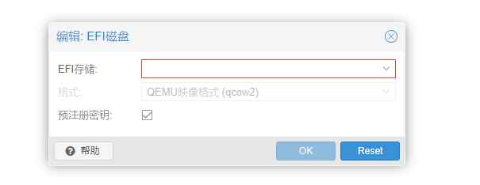

封面来源： [#背景 空へ - 岡虎次郎/Oka Kojiro的插画 - pixiv](https://www.pixiv.net/artworks/102115356)
### 复现
可能是系统安装时未添加EFI磁盘，所以当虚拟机关机重启后，跳转到了系统安装界面


检查硬件，发现并无EFI磁盘。

### 解决
#### 关机
首先将系统关机，这里我采用强制关机（此虚拟机ID为103，请根据自己情况而定）
```
rm /var/lock/qemu-server/lock-103.conf
qm stop 103
```
#### 硬件设置
  
选择一个存储磁盘即可，其他无需配置。

在设置，引导顺序，只勾选硬盘启动

然后启动虚拟机

#### 系统配置


进入系统后提示这个，等待几秒后出现Shell \
输入`exit` 

进入**Device Manager**


选择**Secure Boot Configuration**


选中**Attempt Secure Boot**，点击回车，确保方框内无 `X`


>这一步为关闭安全启动，后续需要可自行打开

连按两次ESC，返回主页面选择Reset


重启后在Shell输入
```
fs0:
edit startup.nsh
```

然后输入以下内容
```
\EFI\debian\grubx64.efi
```
我是用debian举例的，其他系统自行替换

使用ctrl+s保存，再用ctrl+q退出

然后输入reset重启即可


倒计时结束后将自动进入系统