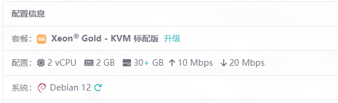
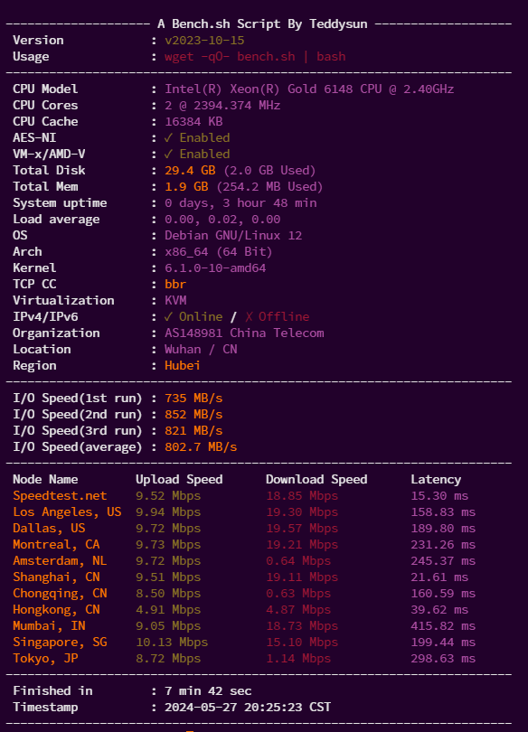
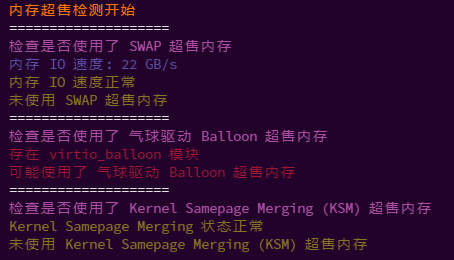
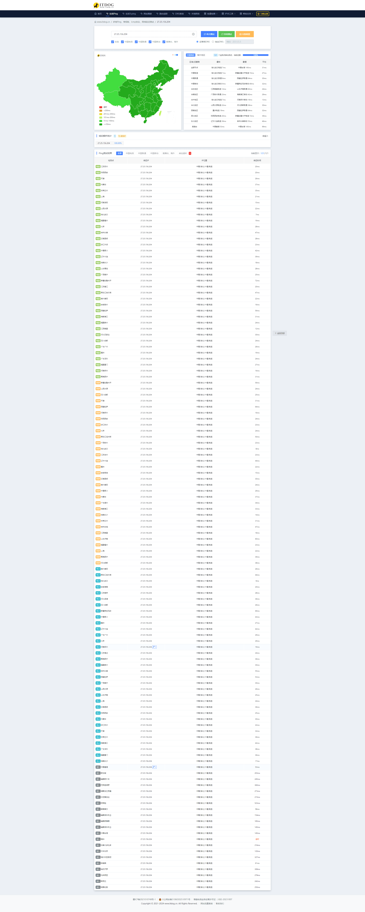
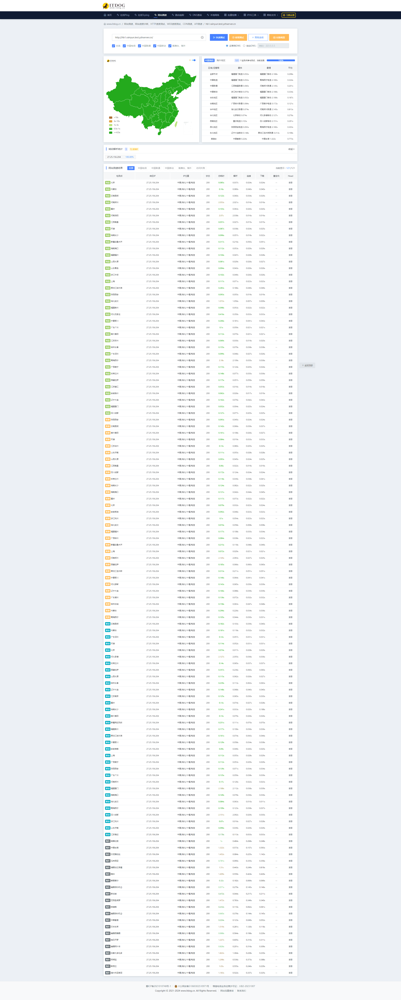

# 前言
此文章为服务器测评类文章，抱着客观的态度来测评任何一台服务器，绝无任何隐瞒欺骗行为！欢迎各位留言提醒。可能有部分内容做的不准确与详细，可以留言提问补充>w<。
# 广告
[雨云](https://blog.sakurasen.cn/rainyun)服务器，新用户首月五折！
[点击注册](https://blog.sakurasen.cn/rainyun)享更多折扣~若已注册，填写邀请码**Sakura**可同享折扣
# 雨云
作为云服务供应商，雨云是我从一开始就使用的产品。从最初的网站上线至今，一直使用的是雨云的服务。也看着雨云从一开始的倒卖服务器到自己成立公司。为什么选择雨云，那就是雨云便宜且相对稳定~

# 测评服务器

## 配置
本次测评服务器为：
 湖北十堰云服务器节点4 | Xeon® Gold - KVM 标配版 | 2vCPU-2GB内存-30GB硬盘-10Mbps上传-20Mbps下载
独立IP，官方宣传400G高防，价格为50/月，弹性硬盘可扩容至250GB

赞助商：我自己

## 性能

### 机器配置，IO读写，网络测速
 

测试结果与宣传结果无太大差距，在误差范围内。

### Ping速度

### 网站速度

## 测试页面

~~http://hb1.rainyun.test.yzhserver.cn/~~

目前已过期！

# 总结

无虚标，可使用。IP为电信优化，拥有独立IP，赠送400G高防，上传速度与下载速度比大厂多。如果是中小型网站不追求稳定性推荐使用。雨云作为小厂，稳定性虽然比其他的厂家好，但并不能说与大厂媲美，但价格优势摆在这里，总体还是推荐购买的。