## 叠甲

本人并非计算机专业，本文章可能并不是特别详细，若有遗漏请评论区指出，如文章意见与您本人意见不同，请友善讨论

## 前言
如果你是一个普通的游戏玩家，喜欢在家里打游戏，那么必定少不了与一起游玩的朋友语音。

市面上的语音软件也层出不穷，例如早期的YY与近期的Oopz，都在语音软件这块市场有自己的一席之地，而玩家对于语音软件的评判标准也就那么几条，无非是方便，实用，好用。

近期被讨伐的KooK之前可以说是占据了语音软件大部分的市场，而为什么一直以来的KooK饱受诟病以至于现在大部分玩家完全放弃KooK了？我觉得大部分原因都来自于KooK自身的商业化失败。

一个语音软件最基础的功能-降噪都要收费，而且自身软件臃肿，一直都有人吐槽他的性能优化，关于KooK的篇幅我就不详细展开了，已经有UP讨论过了。

那么回到我们本期的主要内容:

## 什么是TeamSpeak？

引用TeamSpeak的官方网站一句话：您的团队，由您做主。

在本篇内容中将会从客户端至服务端带你从0入门TeamSpeak

在我眼中看来，TeamSpeak就是自由度极高的一款语音软件，你可以自定义你的频道，自己管理你的频道，一切管理权都在你的手中。

且自身功能十分强大，拥有降噪功能，回声消除，抑制键盘声与回声抑制功能。

而且软件自身占用也小，也有两个版本可供选择，分别是新UI新界面的 TeamSpeak5 与经典Ui经典界面的 TeamSpeak3

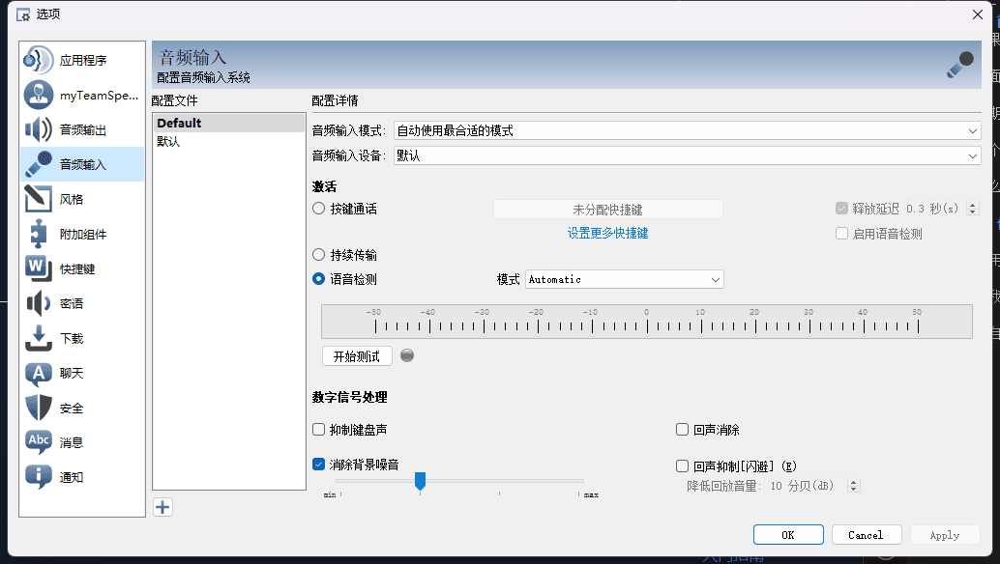

这么强大的功能但现在使用的普及率却少之又少，为什么会这样呢？很大一部分原因

可能就是使用成本高了，此软件如果你想流畅使用的话需要自行购买服务器搭建。

而服务器搭建的门槛却是相对较高的，大部分人可能并不会搭建以及懒得搭建，而在本期内容中，我将带你从0入坑TeamSpeak。

## 客户端安装

### 官网下载

[官网下载](https://teamspeak.com/zh-CN/downloads/)

推荐下载 TS3 本篇文章演示使用的为TS3，TS3相比TS5占用小，更稳定，最多人使用的版本且TS5需要强制登录，TS3无需强制登录。

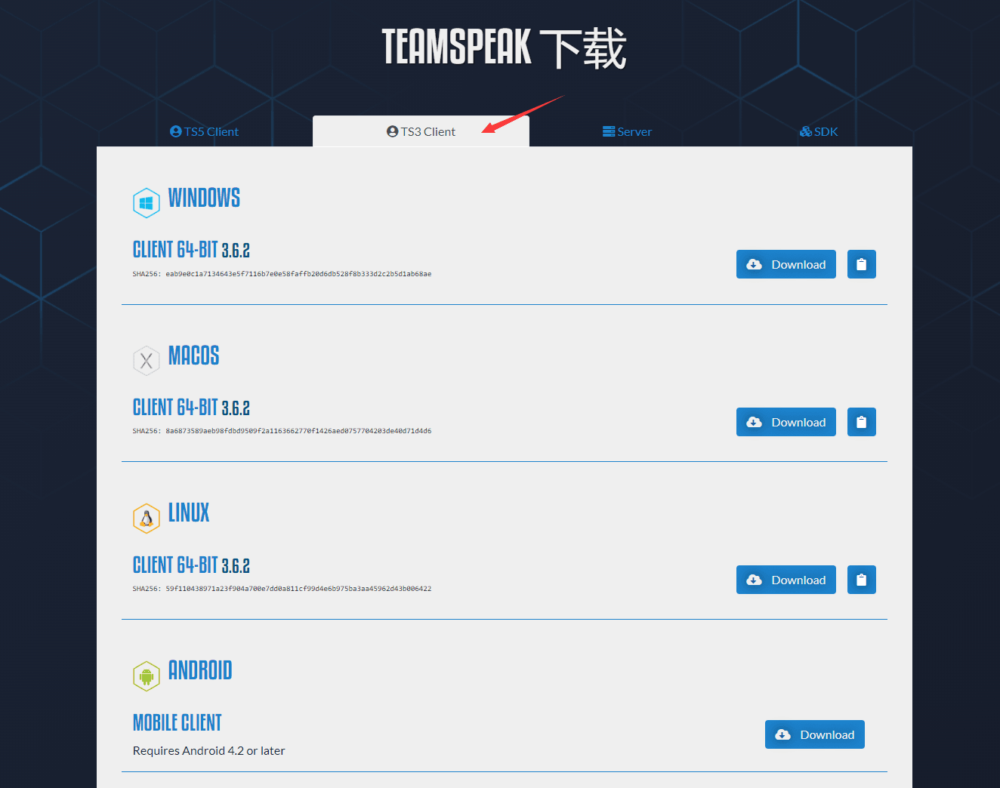

## 客户端汉化

TS5客户端自带汉化， TS3需要安装后下载汉化包双击打开汉化版即可安装

[Github项目地址](https://github.com/VigorousPro/TS3-Translation_zh-CN/) | [本站网盘下载](https://drive.sakurasen.cn/d/D1/TeamSpeak/Chinese_Translation_zh-CN.ts3_translation?sign=iUWf3iXtSs27XrtsCFYJ0hANac_6pMm_bG1reYny8ns=:0) | [Github下载](https://github.com/VigorousPro/TS3-Translation_zh-CN/releases)

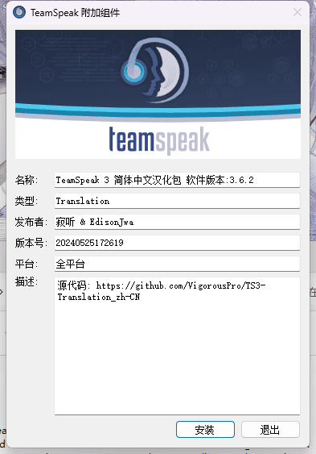

## 服务器选择

在目前，服务器供应商有极其多，大厂有阿里云腾讯云这些，优点是服务器稳定，缺点就是价格昂贵，但如果你是新人，两个大厂都有新人优惠，新用户99元即可购买一年。（此处不是广告，国内服务器价格一般都是偏贵的，99元一年确实是特别值得购买的）

如果你想购买腾讯云的服务器，只需要购买腾讯云的 **轻量应用服务器** 即可满足大部分使用场景

[https://cloud.tencent.com/act/pro/2024Mid-year](https://cloud.tencent.com/act/pro/2024Mid-year)

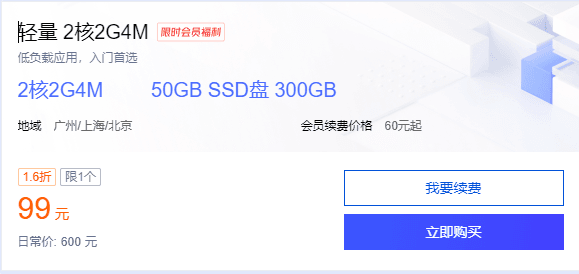

2核2G4M对于TeamSpeak服务器来说相对性能过剩了，购买后不仅可以部署TeamSpeak，如果你有兴趣还可以部署一些其他应用。

如果你购买的是阿里云服务器，那么可以去他们的活动界面

[https://www.aliyun.com/daily-act/ecs/99program](https://cloud.tencent.com/act/pro/2024Mid-year)

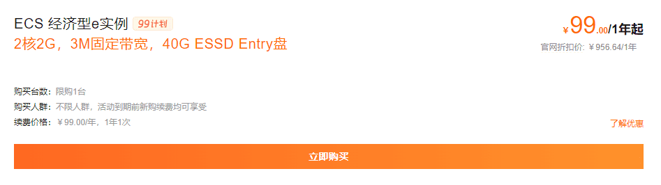

同样购买99/年的服务器。

如果你要选择一些小厂，目前我一直用的小厂只有一家，就是[雨云](https://www.rainyun.com/Sakura_)。

他们的服务器价格是18/月，年付7折。

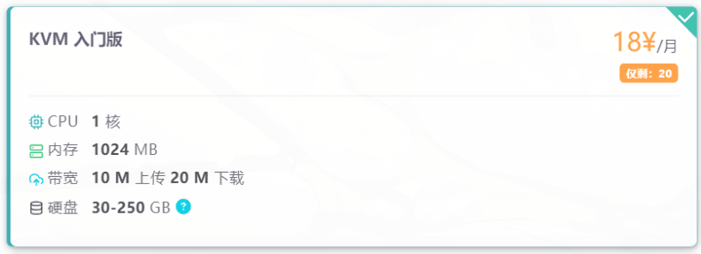

但注意，此套餐是没有公网IP的，只有一个共享IP来让你转发端口实现服务器访问。

此类服务器访问时需要加IP+端口，例如 114.114.514.514:19198 而如果你购买的是以上大厂服务器则自带公网IP，不需要加端口访问，只需要输入 114.114.514.514 即可访问。虽然雨云也可以购买公网IP，但是价格嘛，就......与大厂价格差不多了。本篇文章就只使用阿里云服务器作为讲解，如果有需要我也可以单独出一期视频讲解雨云这类服务器如何部署。

当然，以上服务商都是支持七天无理由退款的。

如果你不想购买服务器，那么也有很多公益服务器可供大家使用，我本人虽没有开建公益服务器，但如果此视频播放量与点赞量高的话，我将会开放公益服务器供大家使用>w<也欢迎大家在评论区分享自己的公益服务器。

## 服务器系统选择

当你购买完服务器后，你需要为你的服务器选择系统，如果你愿意折腾，那么建议你使用Linux系统，我的Linux系统使用的是Debian，那么在本章后续内容中也会采用Debian来演示。当然，如果你不愿意折腾的话，我后面可以出一期Windows如何部署。

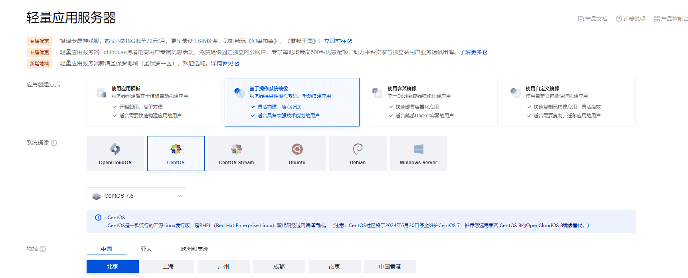

## 服务器搭建

### Linux系统

当你购买完后，你将获得一个公网IP，以及一个服务器密码，如果没有服务器密码的话可以试着在控制台重置密码，每个云服务器厂商的控制台都有区别，正好我的阿里云有一台机器，我将用阿里云举例。

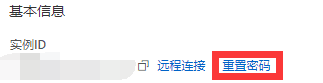

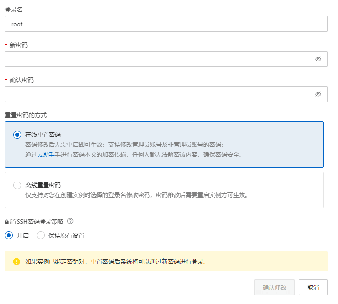

服务器用户名为root，这也是Linux系统的管理员用户名。那么现在你应该就有服务器IP，密码了。

### 连接服务器

一般来说，管理Linux服务器需要下载一个SSH客户端，SSH客户端也层出不穷，每一家都有每一家的优点。大家可以自行搜索下载，这边我拿我经常使用的SSh客户端 **Termius** 举例：

打开连接 [https://termius.com/download/windows](https://termius.com/download/windows) 点击下载即可。

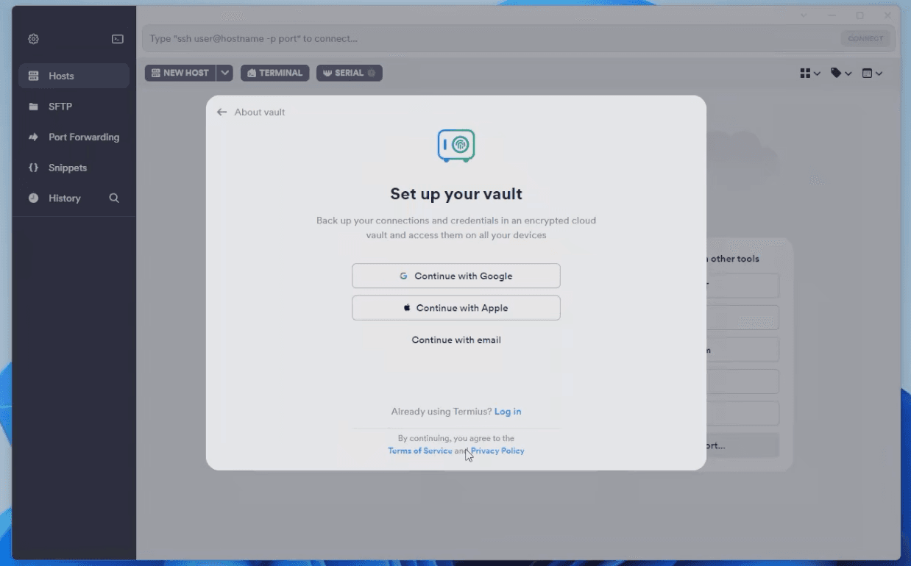

点击邮箱注册即可

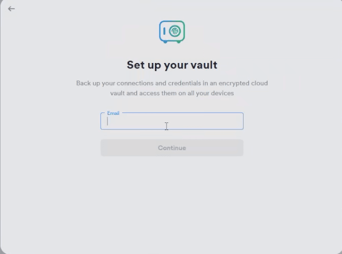

输入你的邮箱

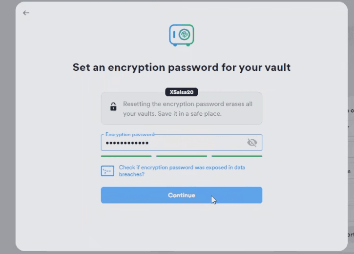

输入你的密码

进入主页面后点击 **NEW HOST** 添加新的服务器

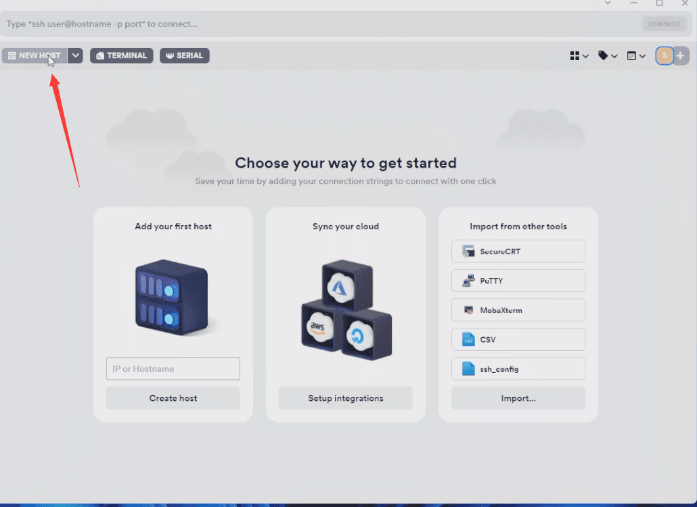

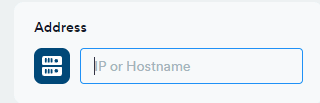

这里是输入IP地址的，填写你购买服务器的IP即可。

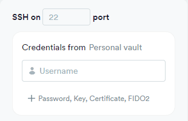

这里是填写服务器端口与用户名密码的，如果你没有修改端口，则默认端口为22，用户名为root。
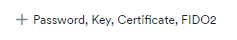 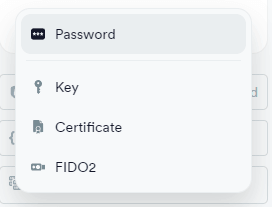

点击添加密码，输入你的密码即可。

添加完你就可以在主页看到你添加的服务器了，双击连接即可。

如果连接失败，请查看服务器防火墙与账号密码是否正确。

#### 检查防火墙

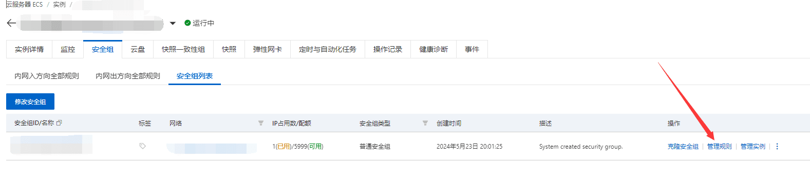

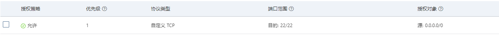

查看22端口(TCP)是否被放行。

### 下载服务器安装包

首先检查命令是否完整

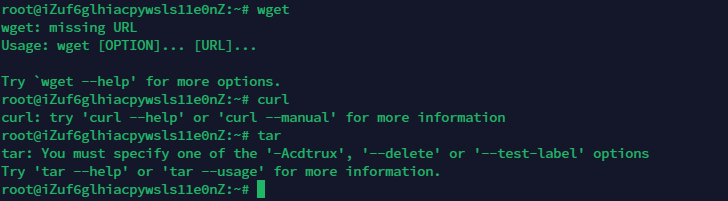

安装一般都会用到这些命令，如果输入后提示 **command not found**

那么需要安装对应的命令，例如缺少wget，则需要输入

`apt install wget`

然后输入 `mkdir /root/ts` 在root目录下新建一个teamspeak目录。

输入 `cd /root/ts` 进入刚才创建的目录

输入

`wget https://files.teamspeak-services.com/releases/server/3.13.7/teamspeak3-server_linux_amd64-3.13.7.tar.bz2` 

来下载服务器安装包，你也可以自己下载上传解压：[官网下载](https://teamspeak.com/en/downloads/#server) | [本站网盘](https://pan.badsen.cn/d/%E9%98%BF%E9%87%8C%E4%BA%91%E7%9B%98/%E8%BD%AF%E4%BB%B6/TeamSpeak/teamspeak3-server_linux_amd64-3.13.7.tar.bz2?sign=MupTEHMOTh3LNuD-pP53gCr79-Mh0FqsXIeiq6gEt6c=:0)

下载完毕后输入

`tar -jxvf teamspeak3-server_linux_amd64-3.13.7.tar.bz2`

即可解压

进入解压后的目录

`cd teamspeak3-server_linux_amd64/`

创建文件同意许可证

`touch .ts3server_license_accepted`

### 启动服务器

输入 `./ts3server` 即可启动服务器

启动后，你需要放行端口，与之前放行22端口一样，请放行 **9987(UDP)** 与 **30033(TCP)** 端口
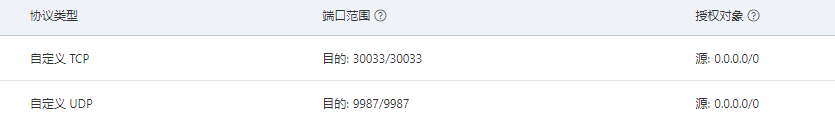

启动后会提供一个权限密钥，你需要登录服务器，然后输入此权限密钥即可获得管理员权限

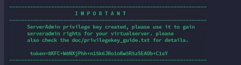

复制'Token='后面的一串密钥，输入权限密钥即可

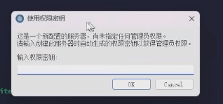

如果现在关闭SSH，则服务器会停止运行，如果你想后台运行，则需要Ctrl+C先关闭服务器，然后输入 `./ts3server_startscript.sh start`

就此，恭喜你，所有服务器内容搭建完毕

## 管理服务器

### 基础操作

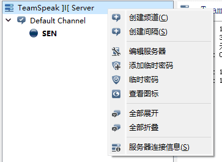

右键TeamSpeak Server即可选择编辑服务器，如果你是新的服务器，请务必设置一个密码。然后推荐你修改一下图标上传大小，因为TeamSpeak服务器默认图标最大上传大小为8KB，打开设置，高级权限设置

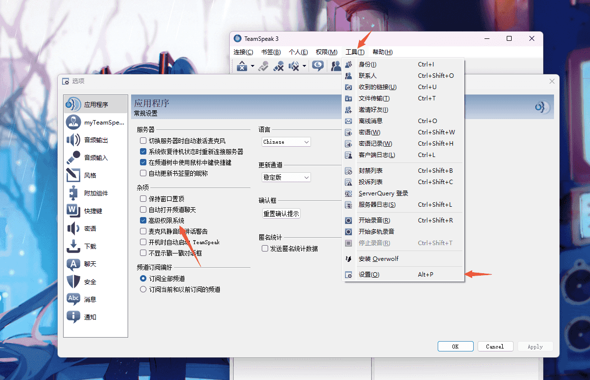

点击权限，服务器组，官方默认给了三个权限：

- Server Admin
- 服务器管理员，权限为75
- Normal 
- 普通用户，权限为50
- Guest
- 默认用户，下载权限为25，发言权限为0
  
你可以右键这三个权限组来重命名等操作

在**Server Admin** -> **Group** -> **i_max_icon_filesize** 修改上传图标大小，单位为Bytes(1Kb=1024Bytes) 

而 i_icon_id  则为权限组图标，你可以自己上传图标来美化服务器

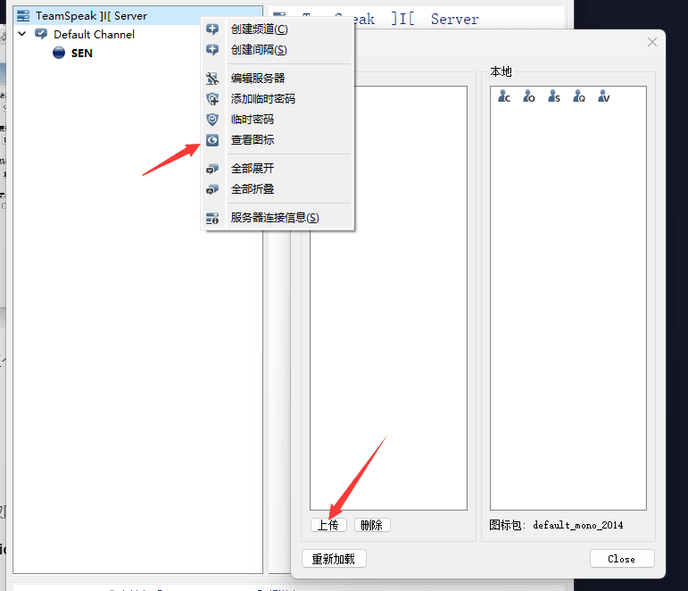

当然你也可以设置语音音质，无脑最高即可
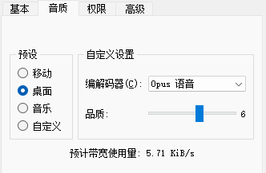

### 权限管理

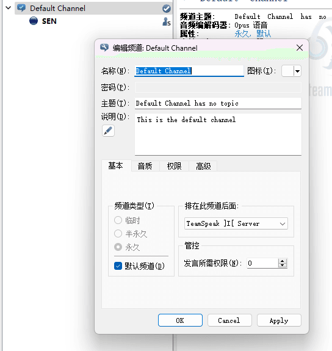

服务器有一个默认频道，这是所有新用户加入进来的第一个频道，此频道不受权限中的加入权限影响，无论数值多少都会在进入服务器时加入，但此频道受 `基本 -> 发言管控` 影响，如果你不想任何人进来都能发言的话可以设置大于75的数值，因为75为管理员数值，大于此数值就意味着包括管理员的任何人都无法在此频道发言。

任何频道的权限都是如此，我已在上方列出各个权限组对应的权限数字，只需要根据数字来调整即可。

### 永久/半永久/临时频道

- 永久频道
- 永久存在于频道中
- 半永久频道
- 服务器重启后消失
- 临时频道
- 频道中无人自动删除

### 注意

默认用户组有权限新建一个临时频道，请在权限管理组移除这个权限，以防万一

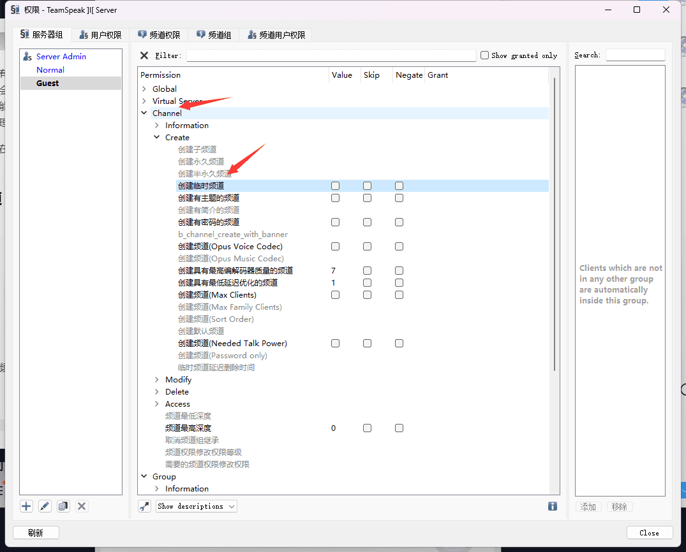

但还是推荐你给服务器加上密码！双重保险

### 常见问题

> 为什么声音忽大忽小？
> - 请移除频道中用户的优先发言人

如果你有更多问题，欢迎加群[629616100](https://jq.qq.com/?_wv=1027&k=G2D7IA7x)来寻求帮助与交流~