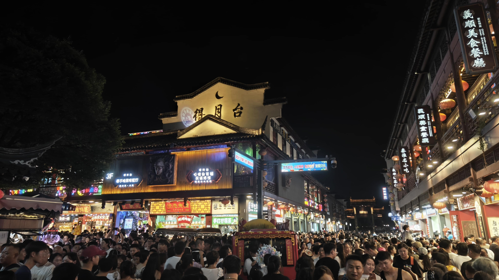

## 开始前

草，这篇文章一共100M多的图片数据，我压缩了图片，想要原图可以联系我

## 南京.

__点首歌__

<iframe frameborder="no" border="0" marginwidth="0" marginheight="0" width=530 height=86 src="//music.163.com/outchain/player?type=2&id=2612419054&auto=1&height=66"></iframe>

秋初，临近开学。欲与友相约出游。乘火车至于南京。

雨，是渐大的，火车驶入南京站前，雨并未显露之来势。直至抵达南京站后，雨势才由牛毛之雨转至倾盆而降的大雨。

南京，省会城市。作为一个省份的代表，其运作模式与我所在的四线城市并不同。与火车下车时出站才发现火车站的站台于地下，旁边即是高铁。而出租车可以选择直接开着地下来接客，车站设置了专门的排队接客地…且供不应求。突如其来的大雨打破了我们的计划。

我们临时决定先前往酒店入住。在之前我们并无规划所去的酒店，准确来说沟通效率低，一场大雨将我们的计划冲散，入住的是一家民宿，四人人均40的价格算得上是便宜的…但代价是什么？

靠近市中心的地段却深藏在一个破旧的小区中，路十分的难找。整个卧室仅有一张大床与一张小床，总共能住三个人的卧室被标为四人间…真的能住四个人吗。是可以的，只是一张小床需要挤两个人。仅是如此吗…？

民宿是一间房子，我们仅是房子中的一个卧室使用者，这间房子还居住着民宿经营者与他的家人。一共三个人…一个老太太，一个女人与一个孩子。入住前无人告知：亦或者是无人留意。因为我并未参与居住地的寻找。我们的一举一动都会被隔壁的人所听到…这就是第一晚。

到达酒店后我们先尝了当地的鸡汁汤包与鸭血粉丝汤，都是12/份。

鸡汁汤包是好吃的，有大块鸡肉与鸡汤，味道浓厚，是非常值得吃的。而鸭血粉丝汤就显得有些平淡了（指味道）整碗汤中有些鸡肠与鸡肝等，但整体味道偏淡，适合口味清淡的人选择。

然后我们前往了先锋书店（五台山店）

先锋书店在南京有很多家店，但我只来过这一家。这家店十分的大，在这里你可以随意阅读书籍。无论是氛围还是书的种类，都是可圈可点的。无论是热门还是冷门的分类这里都有。店内还设立了一个明信片收集的区域: 

  

来自全国各地的旅客都可以将自己所想写在明信片中挂于墙上。没人知道你是谁，对吧。
我也在这里购买了一套毛选，因为一直都想拜读一下。

然后我们返回民宿中休息。直至下午才前往总统府，前往后发现已过参观时间，只好改日再参观。

于是我们不得不前往夫子庙

这是一条商业街，夫子庙的招牌下充满着各种店铺与文创，古风的风格保留着一些历史遗迹，城市繁华的缩影。在游玩时人数格外的多。

    

晚时，结束了夫子庙的旅程后我们前去吃饭，来到本地的一个商城:

这个商场特别大。三楼拥有很多的谷子店，我们在这里逛了许久...也应该只有这里能让我们逛了。南京的消费是高的，对于我所在的四线城市来说算是极高的消费了，而在如此大的商场内的价格也是更贵的，一份蛋包饭就最低30左右。在南京的景点随处可见自动售货机来提供饮料，但价格都是超过一般零售价的。这个商场也不例外。

 

然后就什么也没吃......我们晚上回房间时在路边买了些炸串与啤酒带回去吃了。

第二天，我们起床后还是前往了总统府，到达的时候是中午十二点左右，此时的票已经售罄。
这是个问题，如果你未成年且14岁以上，你需要到达人工窗口购买票，无法通过网络预约，而我们到达时票已售罄，所以如果是这种情况就要更早起来了......所以我们直至走都没有参观总统府。

所以我们就乘坐公交前往了鸡鸣寺，鸡鸣寺作为寺庙也是值得参观的，许多人都前去祈福求平安。

     

从鸡鸣寺出来后即是玄武湖公园，玄武湖公园是特别特别大的，我们转了许久，风景也是优美的。因为是雨过天晴后的玄武湖公园，所以别有一番风味。
站在公园中能看到被一分为二的玄武湖，一面为城市，一面为山。

 

随后，我们前往莲花广场附近，因为刚下过雨，没有多少人。因为玄武湖公园实在是太大了，所以我们不得不乘车而行。价格是20/人，按照固定路线走，我们选择在情侣园下车。

在情侣园下车后你就能看到远处的鸽子广场，这里有许多的鸽子，也有游客在此与鸽子亲密互动
。

喂完鸽子后，我们前往了南京1912街区，但因为是下午，所以并未有什么看点，然后我们前往南京德基广场。

虽然并未购买任何物品，但整个商场给我的感觉就是高端，少了许多亲民的感觉，整体就是高端商店的集合。

 

经过所有楼层后，我们出门后前往酒店，这还是一间民宿，但类似于社群类的民宿，一整层都是房间。在紫金山附近，本来想打算早早起床去爬紫金山。

但第二天起床后就已经是中午了，不知道为什么大家要去十几公里外吃饭，但还是跟从大家去了，乘坐地铁后前往南京大屠杀纪念馆附近吃饭。吃完饭后就已经是下午一点左右了，我们乘坐二号线换乘一号线前往红山动物园。

但，夏天实在是太热了，动物园中的许多动物都因为太热而趴在室内展厅导致观赏性不佳。

 

因为是夏天，所以有很多动物都未曾出现在动物园中，例如老虎，狼，熊等......
有一种被诈骗的感觉。

从动物园出来后差不多就要去前往车站返程了，因为我们没有提前订票，原因是可能会再多游玩一天。我们票是提前一天在南京查询的，发现已经没有车票了，于是我们挂的候补车票，当天晚上所有人都被候补成功了。

黄昏，南京站前的玄武湖是美的。

  

我们也要出发了。

再见，南京。

返程的车上挤满了人，有许多人是没有座位的，只能站在车厢内。
这是一条上海至平顶山的车，近期也许只有此车次能回到家。大家来自不同的地方，但只有一个相同的目的：回家。

---

今天是2024年8月24日，明天就要从高一开始复读了。
在这半年中我想了许多，
也想明白了许多。

总算是明确了自我的目标，回望过去，这一路上坎坎坷坷，经历了太多。

致未来。

2024.8.24
15时许。
