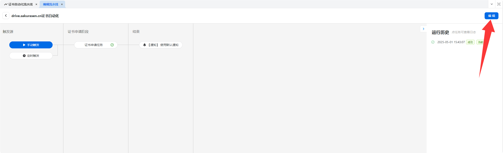

---  
title: Use Pre-made Certificates! No More Manual Applications!  
date: 2025-05-01  
slug: 2025050101  
image: bg.png  
description: Wow, automating SSL certificates is so simple! What was I doing manually configuring every time?  
categories:  
    - 我得
tags:  
    - Automation  
    - SSL Certificates  
    - Certd  
---  

> **Translated by DeepSeek**

## Why Are SSL Certificates So Annoying?  

Back in the day, SSL certificates only needed renewal once a year. But now, it’s every three months. If you’re a paying user, ignore my rant.  

## Fully Automated SSL Certificate Management  

Thanks to **Certd**, we can automate SSL certificate deployment through pipelines.  

[GitHub](https://github.com/certd/certd) | [Official Site](https://certd.docmirror.cn/)  

  

## Getting Started  

Certd offers multiple deployment methods with minimal learning curve.  
[Documentation](https://certd.docmirror.cn/guide/start.html)  

Here’s how to deploy using Docker (example from the official site):  

```bash  
# Create a directory  
mkdir certd  

# Navigate to the directory  
cd certd  

# Download the docker-compose.yaml file (or manually place it in the certd directory)  
wget https://gitee.com/certd/certd/raw/v2/docker/run/docker-compose.yaml  

# Modify configurations as needed:  
# 1. Adjust image version (optional)  
# 2. Set data storage path (optional)  
# 3. Change port numbers (optional)  
vi docker-compose.yaml  # Optional  

# Start Certd  
docker compose up -d  
```  

If you encounter a "docker compose command not found" error, install Docker Compose:  
<https://docs.docker.com/compose/install/linux/>  

After deployment, check accessibility via ports **7001** and **7002**.  
Default credentials: **admin/123456**  

## Email Notifications  

Configure email notifications in the admin dashboard first.  
  

Skip this step if unnecessary, and proceed to create a certificate pipeline.  

## Certificate Pipeline  

  
Click to create a new pipeline.  

  
Fill in the required fields.  

Recommended Certificate Authority: **Google Public CA**. Let’s Encrypt may issue untrusted certificates in some cases ([Check Here](https://myssl.com/)).  

For Google CA, EAB credentials are required during initial setup.  
[EAB Setup Guide](https://certd.docmirror.cn/guide/use/google/)  
Once configured, certificates can be issued even without overseas servers.  

After setup, you’ll see this interface:  
  

Test the pipeline manually:  
  
If successful, the certificate will be issued.  

View certificates in the dashboard:  
  

## Automated Deployment  

### Rainyun Virtual Host (Discontinued)  

If using Rainyun Virtual Host (discontinued), manually add the certificate first:  
1. Go to [SSL Certificate Center](https://app.rainyun.com/apps/ssl/list/free-ssl).  
  
2. Obtain the certificate ID after manual upload.  

Edit the pipeline to add a task:  
  
Select **Custom JS Script**:  
  

Use the following script (modified from the official example):  
```javascript  
const certPem = ctx.self.cert.crt;  
const certKey = ctx.self.cert.key;  

// Upload via HTTP request  
const res = await ctx.http.request({  
    url: "https://api.v2.rainyun.com/product/sslcenter/REPLACE_WITH_YOUR_SSL_ID",  
    headers: {  
        'x-api-key': 'YOUR_RAINYUN_API_KEY'  
    },  
    method: "put",  
    data: {  
        cert: certPem,  
        key: certKey  
    }  
});  

if (!res || res.code !== 200) {  
    throw new Error("Upload failed");  
}  

ctx.logger.info("Upload succeeded", res.data);  
```  

Replace `SSL_ID` and `API_KEY` with your credentials:  
- [Rainyun API Key](https://app.rainyun.com/account/settings/api-key)  
- [SSL Certificate ID](https://app.rainyun.com/apps/ssl/list/free-ssl)  

Finally, configure the SSL port in your server:  
```nginx  
listen 443 ssl http2;  
```  
  

### BT-Panel (宝塔面板)  

Certd offers one-click BT-Panel integration as a premium feature:  
  

For free users:  
- If Certd and the web server are on the same machine, simply copy certificates locally:  
  
- For remote servers, upload certificates via SFTP/SCP:  
  

Add SSL configuration to your site’s Nginx/Apache settings:  
```nginx  
ssl_certificate     /path/to/cert.pem;  
ssl_certificate_key /path/to/cert.key;  
ssl_protocols TLSv1.1 TLSv1.2 TLSv1.3;  
ssl_ciphers EECDH+CHACHA20:EECDH+CHACHA20-draft:EECDH+AES128:RSA+AES128:EECDH+AES256:RSA+AES256:EECDH+3DES:RSA+3DES:!MD5;  
ssl_prefer_server_ciphers on;  
ssl_session_cache shared:SSL:10m;  
ssl_session_timeout 10m;  
add_header Strict-Transport-Security "max-age=31536000";  
error_page 497  https://$host$request_uri;  
```  

### CDN Deployment  

Most CDNs support free SSL uploads directly via Certd:  
