封面来源： [#オリジナル 慵懒 - XilmO@夕末的插画 - pixiv](https://www.pixiv.net/artworks/98841678)

好的，这是一篇文章，在这篇文章，我将讲解如何构建一个我的博客。
为什么写这篇文章呢？
因为我的博客屎山太多了，我受不了于是重构了。

# 开始前

在开始前，我要将一下我的建站历史。
我建站有四年了，虽然没什么技术，但是也是学到了不少内容。
虽然博客只有 2023至今的文章，但实际在之前我就有不少的文章：
[2022年时的网页](https://web.archive.org/web/20221207132712/https://badsen.cn/)*存档与网站博物馆*。
然后后来换为了Hugo，再然后又换回wordpress。
基本常用的网站框架我都尝试过，不过后来还是确定了Hugo。

刚开始建设网站的时候并不懂什么优化，也不懂什么加载速度。
只是什么炫酷什么加，不管别人打开速度有多慢，我自己打开快就行了！（缓存）
甚至大文件加载缓慢我还用了CDN  
再后来突然顿悟了......
之前4k无损图片无脑塞，现在超过1m大小我都要小心翼翼（除了旅行笔记发的图都是直出的）
于是开始了我的优化之路，我放弃了PHP而选择Hugo这种静态网站属于弃繁从简了。
虽然功能性不如Wordpress，但它简洁啊
~~绝对不是我的服务器带不动~~

那么为什么要选择Hugo呢？
可能是因为[Stack](https://stack.jimmycai.com/)确实好看吧。


# 本站逻辑

## ~~之前~~ 现在

【客户端】
当我在客户端修改完文件后，我会Push到Github与我的服务器

【服务器】
当我的服务器收到Push后，会自动触发hooks来执行部署网站

【GitHub】
通过Action自动部署Hugo页面

## ~~如今~~

~~我仔细思考了一下，这种的话如果有Hugo的更新，我无法及时同步所有更新，而且会很麻烦。~~

~~于是我可以这么做。~~

~~【客户端】~~
~~写完文章使用Hugo打包好静态网页直接Push~~

~~【服务端】~~
~~直接部署静态网页~~

# 实践开始

## 安装Hugo

### 下载

首先，我们要部署Hugo。

这很简单，不是吗......嗯？

如果你是Windows系统，直接可以和我学：

打开Hugo Releases

https://github.com/gohugoio/hugo/releases

然后下载

Hugo_ **extended** _ 版本号 _ windows-amd64.zip

请记得，一定要带 **extended**

否则你hugo编译静态资源的时候**无法编译**某些文件

如果你是其他系统，请自强。

下载完后放在一个文件夹中保存

### 配置环境变量
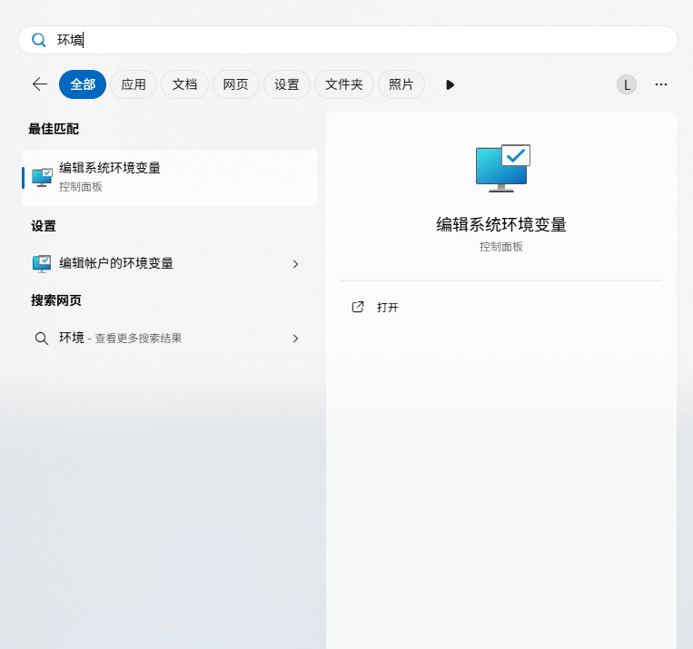
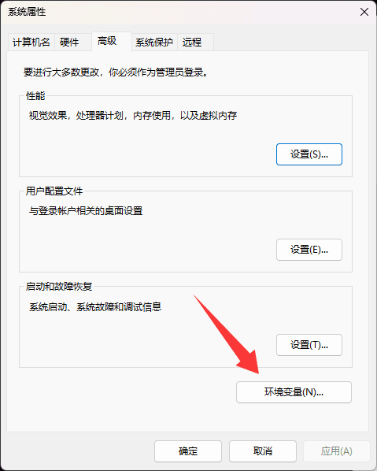
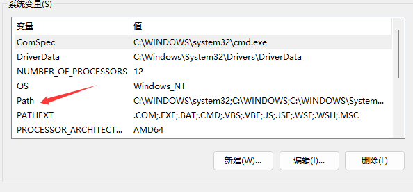
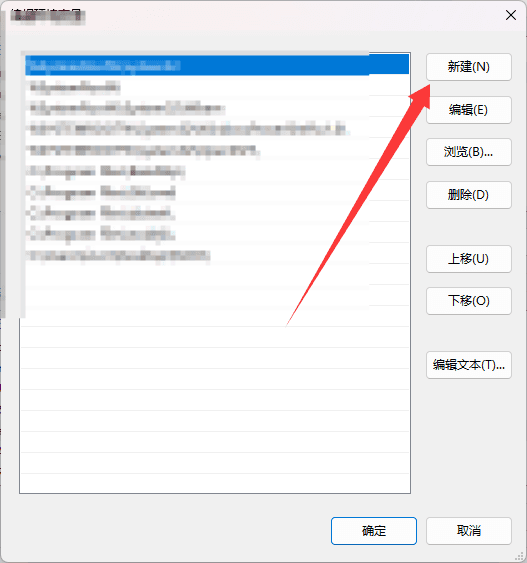

新建一个变量，输入你的Hugo所在目录

例如 `C:\Program Files\Hugo`

只需输入所在目录即可，无需增加 `Hugo.exe`
### 验证


> **If you are a Windows user:**
> 
> - Do not use the Command Prompt
> - Do not use Windows PowerShell
> - Run these commands from [PowerShell](https://learn.microsoft.com/en-us/powershell/scripting/install/installing-powershell-on-windows) or a Linux terminal such as WSL or Git > Bash
> 
> PowerShell and Windows PowerShell [are different applications](https://learn.microsoft.com/en-us/powershell/scripting/whats-new/differences-from-windows-powershell?view=powershell-7.3).

[Quick start](https://gohugo.io/getting-started/quick-start/#commands) Hugo官方似乎并不推荐使用CMD和PowerShell

问一下AI：

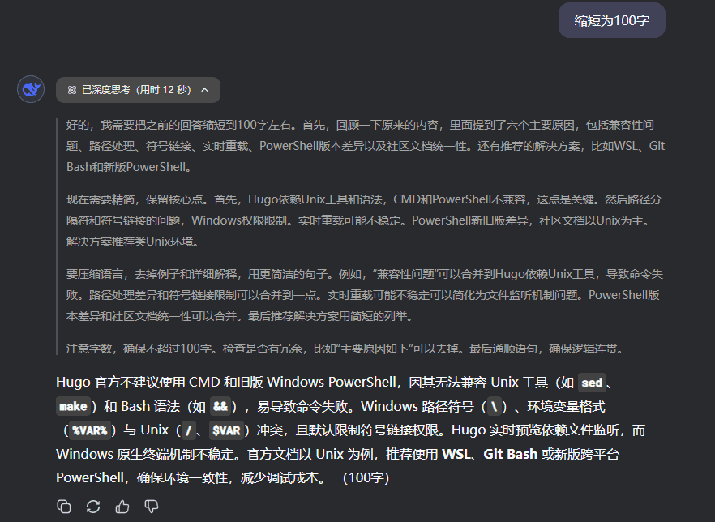

好吧，PowerShell，你赢了

下面我们来安装PowerShell [Installing PowerShell on Windows - PowerShell | Microsoft Learn](https://learn.microsoft.com/en-us/powershell/scripting/install/installing-powershell-on-windows?view=powershell-7.5)

前往[Installing PowerShell on Windows - PowerShell | Microsoft Learn](https://learn.microsoft.com/en-us/powershell/scripting/install/installing-powershell-on-windows?view=powershell-7.5#installing-the-msi-package)

下载适合你的版本，记得选择一下版本，此文章可能会过时

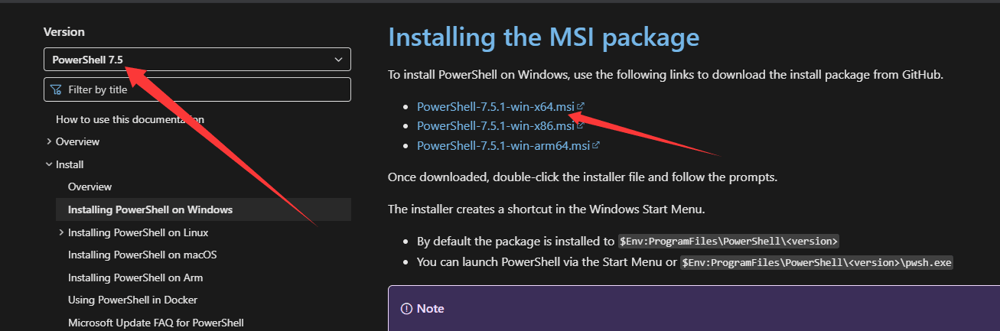

如果你是其他系统无需任何操作

然后Win+R输入pwsh，在PowerShell输入 `Hugo Version`

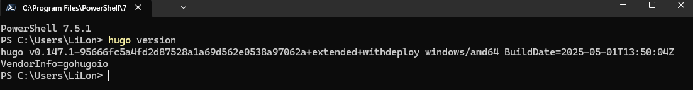

很好！你完成了所有的工作。

其实CMD也不是不能用（

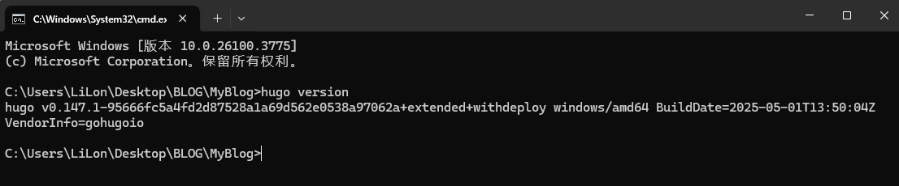

---

很好，现在，你已经有了车轮，那么车身呢？

### 创建新站点

在安装主题前，你需要创建一个新的站点，当你创建后会生成默认文件

找一个空白文件夹，不是空白的也没事.....吧

在文件夹内输入 `hugo new site ./`

如果非空白文件夹，则需要输入 `hugo new site ./ --force`

> hugo new site [path] [flag]

创建完，你会得到这种目录结构：

```
│  hugo.toml
│
├─archetypes
│      default.md
│
├─assets
├─content
├─data
├─i18n
├─layouts
├─static
└─themes
```

创建完后里面文件大部分不需要修改的，如需修改等会告诉你，下面我们来安装主题

## 安装主题

### 关于主题

Hugo 的主题可以说是百花齐放

在 Hugo官网，你可以看到部分主题 [Hugo Themes](https://themes.gohugo.io/)

~~草，刚才去看，这个主题有点好看 [hugo-theme-reimu](https://themes.gohugo.io/themes/hugo-theme-reimu/)~~

好的我们继续，为了不忘初心，我坚持使用 [Stack主题](https://github.com/CaiJimmy/hugo-theme-stack)

### 开始安装

主题的安装很简单，但在之前，请确保你已经[创建新站点](#创建新站点)

按理来说你有三种安装方法 [Getting Started | Stack](https://stack.jimmycai.com/guide/getting-started#git)

本文及我仅使用第一种 [Git](https://stack.jimmycai.com/guide/getting-started#git)

进入你的博客目录，使用指令

`git clone https://github.com/CaiJimmy/hugo-theme-stack/ themes/hugo-theme-stack`

然后你会发现**themes**目录下存在**hugo-theme-stack**文件夹了，~~好神奇啊~~

在 **themes/hugo-theme-stack/exampleSite** 目录下，有主题提供的默认配置文件，复制到你的博客目录下

 `cp .\themes\hugo-theme-stack\exampleSite\hugo.yaml ./`
 
然后删除你的 **hugo.toml** 文件

打开 **hugo.yaml** ，进行配置修改

### 修改配置
我来说一下一些必要修改的配置
#### 网站基础配置

```
baseurl: https://example.com/

languageCode: en-us

theme: hugo-theme-stack

title: Example Site

copyright: Example Person
```

不是，哥们，不会你这个都不想修改吧

```
DefaultContentLanguage: zh-cn //修改为zh-cn，默认文章语言
hasCJKLanguage: true  // 正确的文字统计
languages: //多语言配置，按需配置

    en:

        languageName: English

        title: SakuraSen's BLOG

        weight: 2

        params:

            sidebar:

                subtitle: Limitless progress!

    zh-cn:

        languageName: 中文

        title: 森语

        weight: 1

        params:

            sidebar:

                subtitle: 无限进步！
    sidebar:

        emoji: 🍥 //头像右下的emoji，你可以删了这个

        subtitle: Lorem ipsum dolor sit amet, consectetur adipiscing elit. //如果你配置了多语言，你可以删了这个

        avatar:

            enabled: true //是否启用头像

            local: true //如果是本地图像请启用，网络图像请禁用

            src: img/avatar.png
    article:

        math: true //启用数学渲染？

        toc: true //控制是否默认启用文章目录自动生成功能（基于 Markdown 标题 `##`、`###` 等层级结构）

        readingTime: true //阅读时间

        license: //许可证

            enabled: true

            default: Licensed under CC BY-NC-SA 4.0
    comments: //评论系统管理

        enabled: true

        provider: disqus
    colorScheme: //网站主题颜色

        # Display toggle 切换按钮

        toggle: true

  

        # Available values: auto, light, dark 如果为auto，将会根据用户系统设置自定义

        default: auto

  

    imageProcessing: 图片转换

        cover:

            enabled: true

        content:

            enabled: true

menu:  //菜单

    main: //这个是主菜单，跟你HOME一个级别

        - identifier: TEST

          name: TEST

          url: https://sakurasen.cn

          params:

              icon: test

    social: //这个是社交菜单

        - identifier: github

          name: GitHub

          url: https://github.com/CaiJimmy/hugo-theme-stack

          params:

              icon: brand-github

  

        - identifier: twitter

          name: Twitter

          url: https://twitter.com

          params:

              icon: brand-twitter
```

然后大概也许似乎好像配置完成了。

我建议你去把 **themes\hugo-theme-stack\exampleSite** 下的 **content** 目录中**categories**和**page**复制到你的根目录下合并。

⚠️不要合并post文件夹，否则你在国内会编译错误（Hugo文件夹中使用了twitter的短代码），话说为什么要合并post

这样，你就拥有了侧边框菜单，如果需要更改可以对着默认配置修改。

然后，我们就可以开始写文章了

## 撰写文章
我推荐你使用此文件结构来写文章

```
post
├─文章1
│      1182922.png
│      index.md
```

也就是post文件夹中每一个文章都新建一个文件夹

新建一个md文件，将其命名为**index.md**

在文件开头添加如下内容
```
---
title: 

date: 

draft: true

categories:

image:

description:

---
```

`title:` 标题

`date:` 日期

`draft:` 是否为草稿，true的话文章不会发表

`categories` 分类，例如

```
categories:
    - 我思
    - 我得
```
`image:` 封面

`description:` 描述

你还可以增加`lastmod`，来设置最后修改日期。

然后你就可以开始你的Markdown写作了！

写完后输入 `Hugo` 即可生成 **public** 文件夹 里面是你的网站构建最终产物！

好的，那么接下来我要美化网站了。

## 网站美化

如果你想用我做好的主题，你可以前往[xuesenyaqwq/hugo-theme-stack: Stack主题二次修改](https://github.com/xuesenyaqwq/hugo-theme-stack)

~~愿你美化归来，最后依旧是默认~~

### 在归档页增加标签云Tags 

[原文地址](https://thirdshire.com/hugo-stack-renovation/#%E5%9C%A8%E5%BD%92%E6%A1%A3%E9%A1%B5%E5%A2%9E%E5%8A%A0%E6%A0%87%E7%AD%BE%E4%BA%91tags)

如果你是原生Stack，看起来可能比较拥挤，推荐你增加：
**themes\hugo-theme-stack\assets\scss\custom.scss**
```
.archives-group {

  margin-top: 2em;

}
```

### 在主页添加Tags数字统计

themes\hugo-theme-stack\layouts\partials\widget\tag-cloud.html
```
{{- $context := .Context -}}

{{- $limit := default 10 .Params.limit -}}

<section class="widget tagCloud">

    <div class="widget-icon">

        {{ partial "helper/icon" "tag" }}

    </div>

    <h2 class="widget-title section-title">{{ T "widget.tagCloud.title" }}</h2>

  

    <div class="tagCloud-tags">

        {{ range first $limit $context.Site.Taxonomies.tags.ByCount }}

            <a href="{{ .Page.RelPermalink }}" class="font_size_{{ .Count }}">

                {{ .Page.Title }}

                {{/* 添加计数显示 */}}

                <span class="tagCloud-count">{{ .Count }}</span>

            </a>

        {{ end }}

    </div>

</section>

```


### 关闭颜色遮罩
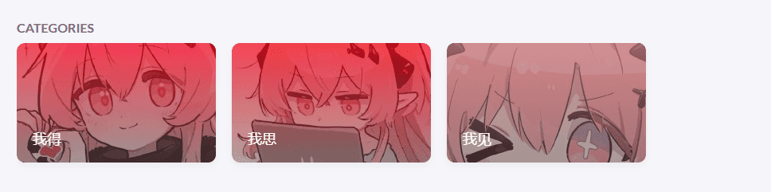

BYD红温小特

themes\hugo-theme-stack\assets\ts\main.ts

50-55行全部注释起来

```
                        /**

                        * articleDetails.style.background = `

                        * linear-gradient(0deg,

                            * rgba(${colors.DarkMuted.rgb[0]}, ${colors.DarkMuted.rgb[1]}, ${colors.DarkMuted.rgb[2]}, 0.5) 0%,

                            * rgba(${colors.Vibrant.rgb[0]}, ${colors.Vibrant.rgb[1]}, ${colors.Vibrant.rgb[2]}, 0.75) 100%)`;

                            */
```


可爱捏

### 修改文章列表
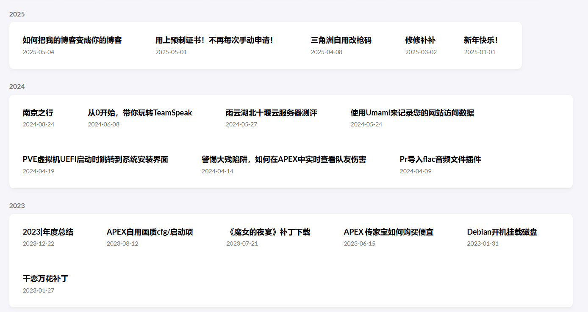

之前的归档界面那么大的长条那么小的图片有点难看，优化了一下去除图片
**themes\hugo-theme-stack\assets\scss\custom.scss**
```
.article-list--compact {

  align-items: center;

  --image-size: 0px;

  display: inline-flex;

  flex-wrap: wrap;

}

.article-list--compact article>a {

  padding: 2em;

}

  

.article-list--compact article:not(:last-of-type) {

  border-bottom: none;

  justify-content: space-between;

}
```

如果你想保留图片，可以删掉 **--image-size: 0px;** 或者改成自己想要的数值

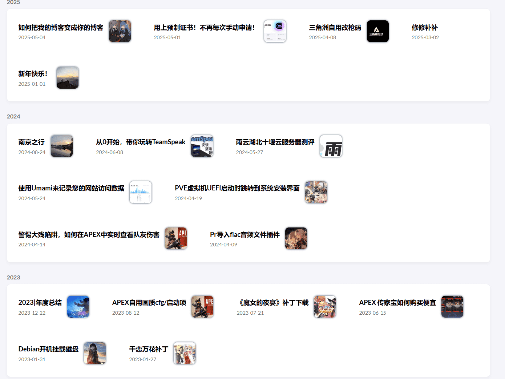

byd意外发现挺好看，保留了

```
.article-list--compact {

  align-items: center;

  --image-size: 60px;

  display: inline-flex;

  flex-wrap: wrap;

}

.article-list--compact img {

  border-radius: 10px;

  box-shadow: 0 0 0.3em;

}
```

又研究了一下
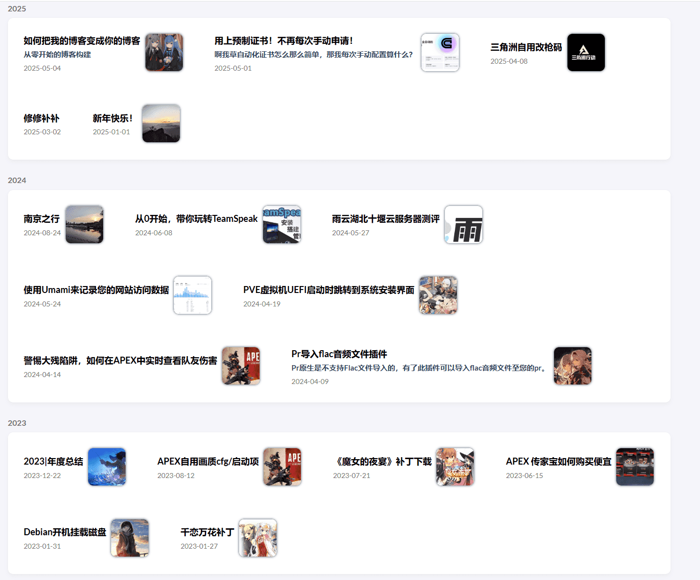

增加了描述：
**themes\hugo-theme-stack\assets\scss\custom.scss**
```
.article-list--compact {

  align-items: center;

  --image-size: 75px;

  display: inline-flex;

  flex-wrap: wrap;

}

.article-list--compact img {

  margin-left: 10px;

  border-radius: 10px;

  box-shadow: 0 0 0.3em;

}

.article-list--compact article>a {

  gap: 0;

  padding: 2em;

}

  

.article-list--compact article:not(:last-of-type) {

  border-bottom: none;

  justify-content: space-between;

}

.article-description {

  padding: 0;

  margin: 0;

  font-size: 15px;

}
```

**themes\hugo-theme-stack\layouts\partials\article-list\compact.html**

```
<article>

    <a href="{{ .RelPermalink }}">

        <div class="article-details">

            <h2 class="article-title">

                {{- .Title -}}

            </h2>

            {{ with .Params.description }}

        <h3 class="article-description">

            {{ . }}

        </h3>

        {{ end }}

            <footer class="article-time">

                <time datetime='{{ .Date.Format "2006-01-02T15:04:05Z07:00" }}'>

                    {{- .Date.Format (or .Site.Params.dateFormat.published "Jan 02, 2006") -}}

                </time>

            </footer>

        </div>
```

### 友情链接为双列
[原文地址](https://oxidane-uni.github.io/p/%E4%BD%BF%E7%94%A8-hugo-%E5%AF%B9%E5%8D%9A%E5%AE%A2%E7%9A%84%E9%87%8D%E5%BB%BA%E4%B8%8E-stack-%E4%B8%BB%E9%A2%98%E4%BC%98%E5%8C%96%E8%AE%B0%E5%BD%95/#%E5%8F%8B%E6%83%85%E9%93%BE%E6%8E%A5%E6%94%B9%E4%B8%BA%E5%8F%8C%E5%88%97%E6%98%BE%E7%A4%BA)
**themes\hugo-theme-stack\assets\scss\custom.scss**
```
@media (min-width: 1024px) {
  .article-list--compact.links {
      display: grid;
      grid-template-columns: 1fr 1fr;
      background: none;
      box-shadow: none;
      
      article {
          background: var(--card-background);
          border: none;
          box-shadow: var(--shadow-l2);
          margin-bottom: 8px;
          border-radius: 10px;
          &:nth-child(odd) {
              margin-right: 8px;
          }
      }
  }
}
```
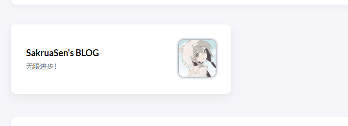

如果你用了[修改文章列表](#修改文章列表)，那么你的头像会加个边框，草。

### 为文章增加字数统计

[原文地址](https://oxidane-uni.github.io/p/%E4%BD%BF%E7%94%A8-hugo-%E5%AF%B9%E5%8D%9A%E5%AE%A2%E7%9A%84%E9%87%8D%E5%BB%BA%E4%B8%8E-stack-%E4%B8%BB%E9%A2%98%E4%BC%98%E5%8C%96%E8%AE%B0%E5%BD%95/#%E6%B7%BB%E5%8A%A0%E5%AD%97%E6%95%B0%E7%BB%9F%E8%AE%A1)

首先在`congfig.yaml`中的`.params.article`中添加：

wordCount: true

然后修改：

**themes\hugo-theme-stack\layouts\partials\article\components\details.html**

```
    <footer class="article-time">

        {{ if $showDate }}

        <div>

            {{ partial "helper/icon" "date" }}

            <time class="article-time--published">

                {{- .Date | time.Format (or .Site.Params.dateFormat.published "Jan 02, 2006") -}}

            </time>

        </div>

        {{ end }}

  

        {{ if $showReadingTime }}

        <div>

            {{ partial "helper/icon" "clock" }}

            <time class="article-time--reading">

                {{ T "article.readingTime" .ReadingTime }}

            </time>

        </div>

        {{ end }}

        {{ if .Site.Params.article.readingTime }}

        <div>

            {{ partial "helper/icon" "file-description" }}

            <time class="article-words">

                {{ T "article.wordCount" .WordCount }}

            </time>

        </div>

        {{ end }}

  

    </footer>
```

这一段直接覆盖即可

打开i18n文件，

**themes\hugo-theme-stack\i18n\zh-cn.yaml**

```

article:

    back:

        other: 返回

  

    tableOfContents:

        other: 目录

  

    relatedContent:

        other: 相关文章

  

    lastUpdatedOn:

        other: 最后更新于

  

    readingTime:

        other: "阅读时长: {{ .Count }} 分钟"

    wordCount:

        other: "{{.Count}} 字"

    totalword:

        other: "发表了 {{ .PostCount }} 篇文章 · 总计 {{ .TotalWords }} 字"
```

然后找一个图标，重名名为 **file-description** 放于 themes\hugo-theme-stack\assets\icons
[iconfont-阿里巴巴矢量图标库](https://www.iconfont.cn/search/index?searchType=icon&q=words)
### 全站字数统计

[原文地址](https://thirdshire.com/hugo-stack-renovation/#%E6%80%BB%E5%AD%97%E6%95%B0%E7%BB%9F%E8%AE%A1%E5%8F%91%E8%A1%A8%E4%BA%86x%E7%AF%87%E6%96%87%E7%AB%A0%E5%85%B1%E8%AE%A1x%E5%AD%97)

如果你已经修改了上方的i18n文件，则可以直接跟我走：

**themes\hugo-theme-stack\layouts\partials\footer\footer.html**

```
    <section class="totalcount">

        {{ $scratch := newScratch }}

        {{ range where .Site.Pages "Kind" "page" }}

        {{ $scratch.Add "total" .WordCount }}

        {{ end }}

  

        {{ $postCount := len (where .Site.RegularPages "Section" "post") }}

        {{ $totalWords := div ($scratch.Get "total") 1 }}

  

        {{ $params := dict

        "PostCount" $postCount

        "TotalWords" $totalWords

        }}

  

        {{ T "article.totalword" $params | safeHTML }}

    </section>
```

放在你想要的位置

**themes\hugo-theme-stack\assets\scss\custom.scss**

设置css

```
.totalcount {
    color: var(--card-text-color-secondary);
    font-weight: normal;
    margin-bottom: 5px;
    }

```

### 外部链接后显图标

**themes\hugo-theme-stack\layouts\_default\_markup\render-link.html**

新增代码：

```
{{ if strings.HasPrefix .Destination "http" }}
<span style="white-space: nowrap;"><svg width=".7em"
    height=".7em" viewBox="0 0 21 21" xmlns="http://www.w3.org/2000/svg">
    <path d="m13 3l3.293 3.293l-7 7l1.414 1.414l7-7L21 11V3z" fill="currentColor" />
    <path d="M19 19H5V5h7l-2-2H5c-1.103 0-2 .897-2 2v14c0 1.103.897 2 2 2h14c1.103 0 2-.897 2-2v-5l-2-2v7z"
        fill="currentColor">
</svg></span>
{{ end }}
```

### 自动修改最后更新时间
[原文地址](https://oxidane-uni.github.io/p/%E4%BD%BF%E7%94%A8-hugo-%E5%AF%B9%E5%8D%9A%E5%AE%A2%E7%9A%84%E9%87%8D%E5%BB%BA%E4%B8%8E-stack-%E4%B8%BB%E9%A2%98%E4%BC%98%E5%8C%96%E8%AE%B0%E5%BD%95/#%E6%96%87%E7%AB%A0%E4%BF%AE%E6%94%B9%E6%97%B6%E9%97%B4%E6%98%BE%E7%A4%BA)

设置中增加：

```
frontmatter:
  lastmod: [":fileModTime", "lastmod"]
```

### 加载进度条
**hugo-theme-stack/layouts/partials/footer/custom.html**

```
<!-- layouts/partials/footer/custom.html -->
<script
    src="https://cdn.jsdelivr.net/gh/zhixuan2333/gh-blog@v0.1.0/js/nprogress.min.js"
    integrity="sha384-bHDlAEUFxsRI7JfULv3DTpL2IXbbgn4JHQJibgo5iiXSK6Iu8muwqHANhun74Cqg"
    crossorigin="anonymous"
></script>
<link
    rel="stylesheet"
    href="https://cdn.jsdelivr.net/gh/zhixuan2333/gh-blog@v0.1.0/css/nprogress.css"
    integrity="sha384-KJyhr2syt5+4M9Pz5dipCvTrtvOmLk/olWVdfhAp858UCa64Ia5GFpTN7+G4BWpE"
    crossorigin="anonymous"
/>
<script>
    NProgress.start();
    document.addEventListener("readystatechange", () => {
        if (document.readyState === "interactive") NProgress.inc(0.8);
        if (document.readyState === "complete") NProgress.done();
    });
</script>

```

### 代码块样式修改

**hugo.yaml**

```
markup:

    goldmark:

        extensions:

            passthrough:

                enable: true

                delimiters:

                    block:

                        - - \[

                          - \]

                        - - $$

                          - $$

                    inline:

                        - - \(

                          - \)

        renderer:

            ## Set to true if you have HTML content inside Markdown

            unsafe: true

    tableOfContents:

        endLevel: 4

        ordered: true

        startLevel: 2

    highlight:

        noClasses: true

        codeFences: true

        guessSyntax: true

        lineNoStart: 1

        lineNos: false

        lineNumbersInTable: true

        tabWidth: 4

        style: onedark
```

修改配置文件

**themes\hugo-theme-stack\assets\scss\custom.scss**

```
.article-content .highlight {

  background-color: #282c34;

}
```

新增样式

### 网站字体修改

前往 [Google Fonts](https://fonts.google.com/) 

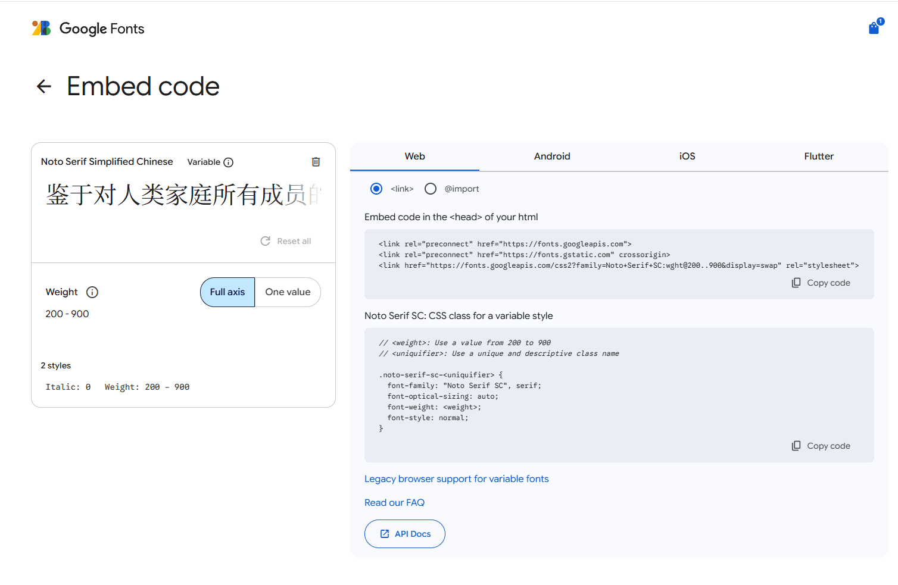

复制你想要的字体

**themes\hugo-theme-stack\layouts\partials\head\custom.html**
```
<link rel="preconnect" href="https://fonts.googleapis.com">
<link rel="preconnect" href="https://fonts.gstatic.com" crossorigin>
<link href="https://fonts.googleapis.com/css2?family=Noto+Serif+SC:wght@200..900&display=swap" rel="stylesheet">
```

尽量不要选择Full axis，因为太大了

themes\hugo-theme-stack\assets\scss\custom.scss

```
// 文章页字体

body, .article-content {

  font-family: 'Noto Serif SC', serif;

}

  

// 标题字体

body, .article-title {

  font-family: 'Noto Serif SC', serif;

}

  
  

// 首页字体

body, .article-page {

  font-family: 'Noto Serif SC', serif;

}
```

如果你想自己部署的话，可以下载字体包，修改css文件中的url来达到加速效果

## 网站优化

当你一切工作完成后，你会发现你的网站使用了大量第三方请求。

请前往：
themes\hugo-theme-stack\data

将文件中的链接替换为加速链接！

在构建时，你可以使用--minify来压缩css/html等

hugo --minify

## 写作

解决完读的问题，那么我们来解决一下写的问题

在Windows平台，我推荐的写作软件是 https://obsidian.md/

为什么？ 我也不知道，我之前使用的一直是vscode手打

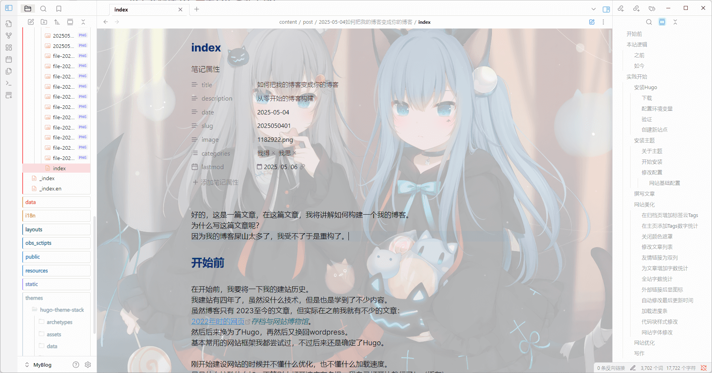

然后我看有人推荐我就用了

### 如何使用
下载安装，然后设置完后去关闭安全模式

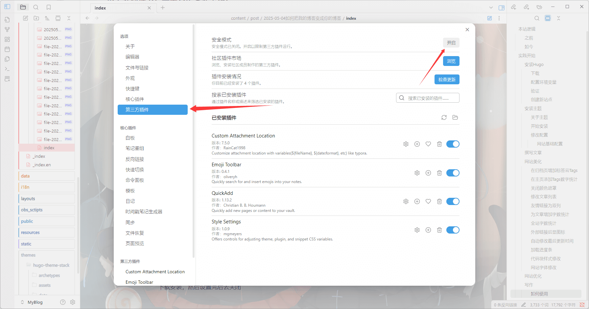

然后就可以安装插件了

首先可以安装**QuickAdd**，这个可以让你一键创建新文章。

首先在你的博客文件夹内创建文件夹 **obs_sctipts**

新建一个js文件，名称任意：
```
const util = require('util');

const child_process = require('child_process');

const exec = util.promisify(child_process.exec);

  

function getCreateTimeAsFileName() {

     var d = new Date();

     var year = d.getFullYear();

     var month = d.getMonth()+1;

     var day = d.getDate();

     var hour = d.getHours();

     var minute = d.getMinutes();

     var second = d.getSeconds();

     var time = year+"m"+month+"d"+day+"h"+hour+"m"+minute+"s"+second;

     return time;

}

  

  

// execute command function

  

async function executeCommand() {

     const fileName = "index.md";

     const { stdout, stderr } = await exec('hugo new post/' + getCreateTimeAsFileName() +'/'+fileName,{cwd: app.fileManager.vault.adapter.basePath});

     console.log('stdout:', stdout);

     console.log('stderr:', stderr);

     if (stdout) {

         new Notice("New Blog Created["+fileName+"]")

     }else{

         new Notice("New Blog Create Faild. "+stderr)

     }

}

  

  

module.exports = async function(context, req) {

    await executeCommand();

}
```

然后跟着我设置：

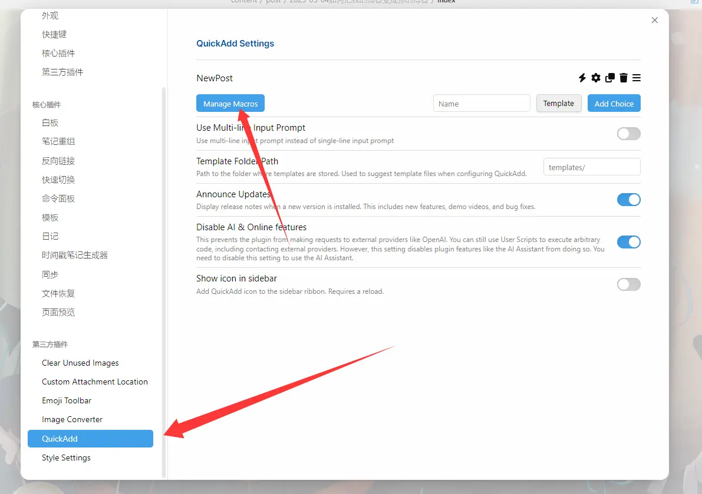


随便填个名称，然后点击设置

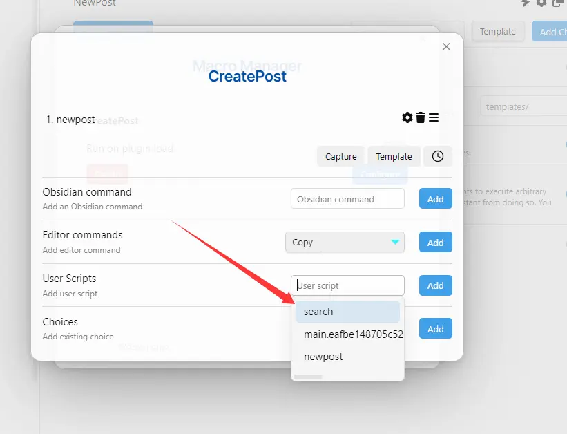

在脚本里设置你添加的脚本，然后点击add即可

Ctrl+P，搜QuickAdd即可

然后就完成啦！恭喜！

## 后日谈

就先写这么多吧！写了几天，主要是在优化和debug。

我写完这篇文章还要去改一下之前的文章，毕竟之前的文章写的太垃圾了。。
