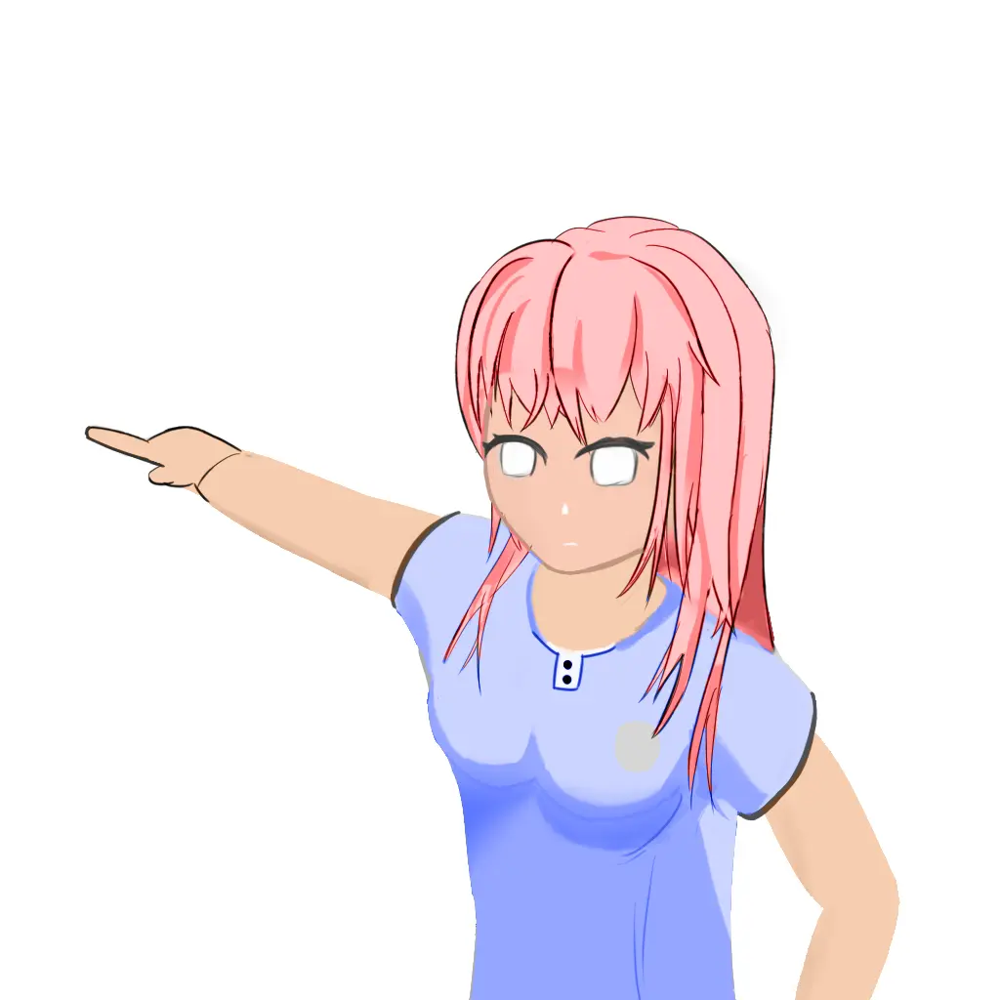
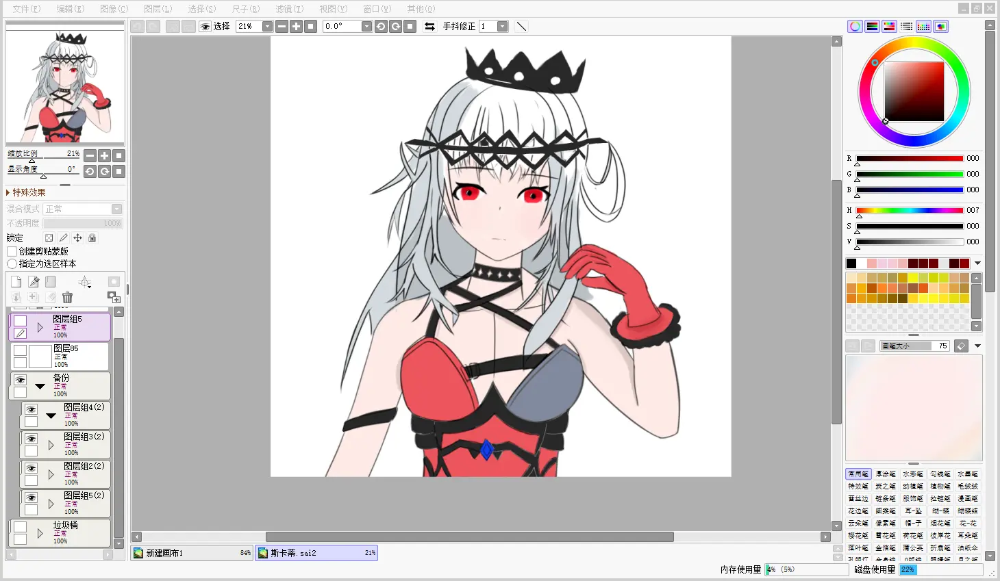

*封面来源[#女の子 【约稿展示】软乎乎\~ - 可乐米mi的插画 - pixiv](https://www.pixiv.net/artworks/130471028)*
## 前言

嗯，几年前买了个板子，一直想学画画。

最近兴趣来了，那就记录一下我从零开始板绘的日志吧

软件：[Sai2](https://drive.sakurasen.cn/d/D2/%E8%BD%AF%E4%BB%B6/other/%5B2023%5Dsai2.exe?sign=wIfZ31-WboMeGCWVNgCra4lgKkCwzZfd0r-sDE5FX7o=:0)

*淘宝买的，点击就能下载*

板子：UGEE RB170

## 记录

## 2025-05-15

不想画了，怎么越来越丑了
这个是配色没选好，图层搞错了

{{
}}
<video style="width: 100%; height: 100%; object-fit: contain;" controls>
  <source src="https://drive.sakurasen.cn/d/D2/videos/%E5%BC%95%E7%94%A8/2025-05-14_15-22-59.mp4?sign=j8fnHvAqySEZpYdfxr9737zDcvKYQmUUyTaFOK-sQW8=:0" type="video/mp4">  
 您的浏览器不支持 video 标签</video>
{{
}}

## 2025-05-14

第一张画。

画的时候没绷住，可以看出来完成度不高。

因为第一次画还不知道具体的流程，所以踩了很多坑。

可以看到二分并不是很理想，因为我铺完固有色不知道干什么了。

上色之前感觉还能凑合看看。
后面真的画不下去了所以不想画了。

